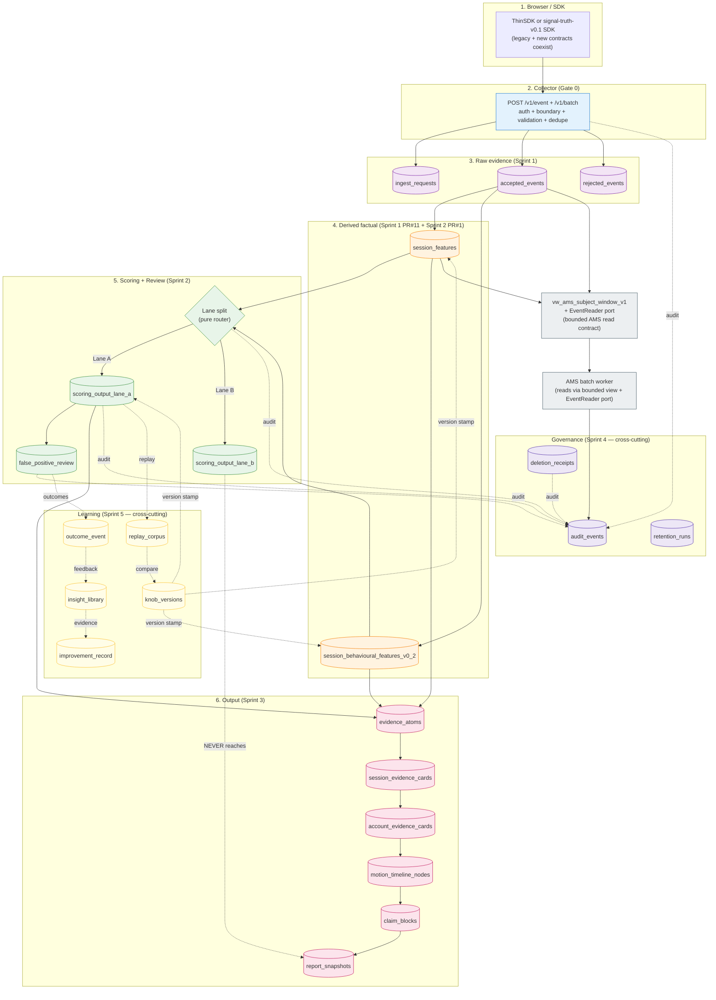
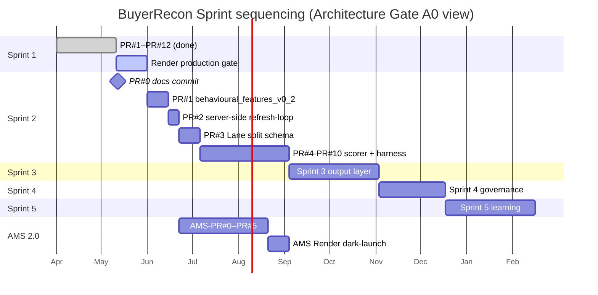

# BuyerRecon Architecture Gate A0

| Field | Value |
|---|---|
| Status | **DRAFT — awaiting Helen's review and approval.** |
| Date | 2026-05-11 |
| Owner | Helen Chen, Keigen Technologies (UK) Limited |
| Scope | BuyerRecon Sprint 1–5 master gate + AMS Architecture 2.0 mapping |
| Prerequisite for | Any further production work and any Sprint 2 coding |
| Reading order | §0 → §0.5 → §0.6 → §P → then appendices A–R as needed |

> **Hard rule.** This document is an architecture gate. **No Sprint 2 code is written, no Render production migration is applied, no live SDK rollout is permitted, until this RFC is approved by Helen and the Commit #1 contract artefacts (`docs/contracts/signal-truth-v0.1.md` + `scoring/reason_code_dictionary.yml` + `scoring/forbidden_codes.yml`) are committed and signed off** (per `signal-truth-v0.1.md` §13.1).

---

## §0 Executive summary

**The five facts that gate Sprint 2.**

1. **FACT.** Sprint 1 PR#1–PR#12 closed. `buyerrecon-backend` HEAD `4fec39e18c66de00ac7d1ff2ad185402498ac1d0` (PR#12). **Implementation / code tree is clean** at PR#12 (no modified tracked files; `tsc --noEmit` clean; `npm test` = 1677/1677). **Architecture + deep-research docs are draft + untracked**: `git status --short` at the time of this RFC shows `?? docs/architecture/` (contains this RFC) and `?? docs/deepresearch/` (contains the Sprint 2–5 source research). **This RFC itself is draft + uncommitted** awaiting Helen's approval per §0.7.
2. **FACT.** PR#11 + PR#12 were proven **only on Hetzner staging** (`/opt/buyerrecon-backend` against `127.0.0.1` Postgres). **Render production DB has not been touched.**
3. **FACT.** Sprint 2 contract decisions are pinned in `/Users/admin/github/buyerrecon-backend/docs/deepresearch/sprint 2/signal-truth-v0.1.md` (canonical, 510 lines) plus `reason_code_dictionary.yml` (259 lines) and `forbidden_codes.yml` (199 lines). Sprint 2 §13.1 explicitly says: *"No code is written before commit #1 signoff."*
4. **FACT.** AMS at `/Users/admin/github/keigentechnologies/AMS` is on `main` HEAD `9bf4cc9 merge: feat/thin-layer-v1 → main` with **uncommitted changes** (6 modified files + multiple untracked docs + a tracked 11 MB binary `buyerrecon-report`). AMS has no `render.yaml`. Its README explicitly says "Schedule automated runs (cron or Render cron job)" is a *next step*.
5. **FACT.** Track A `/Users/admin/github/ams-qa-behaviour-tests` is **not a Git repo** (`fatal: not a git repository`). Stage 0 (`lib/stage0-hard-exclusion.js`, 215 lines, 30 tests per docs) and Stage 1 (`lib/stage1-behaviour-score.js`, 385 lines, ~130 tests post-Codex fix) are pure-function libraries ready to vendor into Sprint 2 downstream workers.

**The single load-bearing recommendation.** **Do not start Sprint 2 coding yet.** The right next move is a **docs-only commit (Sprint 2 PR#0)** of the three Commit #1 artefacts into `docs/contracts/` + `scoring/`, followed by Render production preflight SQL run against a **staging mirror, not Render production**, followed by Helen's written sign-off on open decisions P-1, P-2, P-3 in §P. Implementation code follows after that — not before.

**What's at stake if we skip the gate.** (a) AMS today filters `accepted_events` on `event_type='session_start'` (legacy thin-v2.0); PR#10 v0.1 events use `event_type='track'` with `event_name IN ('cta_click', 'form_start', 'form_submit')`. Two contracts coexist on the same table. If we ship Sprint 2 scoring without deciding P-2 (raw vs `session_features` consumer surface), AMS and Sprint 2 scorer will both compete for `accepted_events` reads with no contract layer. (b) Sprint 2 introduces Lane A vs Lane B and 10 hard rules that the existing collector schema needs to coexist with (`scoring_output_lane_a` / `scoring_output_lane_b`, Postgres role enforcement, CI SQL linter). Landing these without a documented compatibility plan against AMS 2.0 risks 6 weeks of cleanup. (c) The Sprint 2 RECORD_ONLY gate (8 weeks + 500 medium-band reviews + 2 weeks stability) starts the clock from "first production scoring write" — wrong-foot the start and the gate is unverifiable.

---

## §0.5 Recommended next action — the 3 concrete steps

1. **Sprint 2 PR#0 — docs-only commit, AFTER contract cleanup fixes.** Create a feature branch in `buyerrecon-backend`. **Before copying the three canonical artefacts, apply three contract cleanup fixes against the deep-research source files** (so the cleaned versions are what lands in `docs/contracts/` + `scoring/`):

   **Contract cleanup fixes (required, blocking PR#0 commit):**

   - **CF-1.** Remove the duplicate hard-rule row labelled `G` in `docs/deepresearch/sprint 2/signal-truth-v0.1.md` §10. Renumber subsequent rows if needed so the A–I sequence has no duplicate ID. Cross-references to Hard Rule G elsewhere (§D step annotations, Appendix D) follow whichever rule remains under the canonical ID.
   - **CF-2.** Clarify in `docs/deepresearch/sprint 2/forbidden_codes.yml` (and propagate to the cleaned `scoring/forbidden_codes.yml`) that the regex patterns under `hard_blocked_code_patterns` apply **only to emitted reason_code strings**, **not** to schema field names. Schema fields like `verification_method_strength` (which contains the substring `_VERIFIED` once the suffix is included) **must not** be blocked by the `.*_VERIFIED$` pattern. The fix: add an explicit `applies_to: emitted_reason_codes_only` annotation; keep `string_patterns_blocked_in_code` as the separate source-code-string sweep that *does* apply across the codebase.
   - **CF-3.** Replace or neutralise the `can_trigger_action: true|false` field on every entry in `docs/deepresearch/sprint 2/reason_code_dictionary.yml` with **two new fields**:
     - `can_route_to_review: true|false` (whether the code can route an instance to the FP review queue)
     - `can_trigger_automated_action: false` (always false in v1; no code triggers `exclude`/`block`/`allow` in v1 regardless of lane)

     In v1: `can_trigger_automated_action` MUST be `false` for every code. Lane A codes that previously had `can_trigger_action: true` get `can_route_to_review: true`. Lane B codes get both fields `false` (Lane B never routes to customer-facing review). REVIEW codes get `can_route_to_review: true`. OBS codes get both fields `false`.

   **Then copy the cleaned canonical artefacts:**

   - `docs/deepresearch/sprint 2/signal-truth-v0.1.md` (with CF-1 applied) → `docs/contracts/signal-truth-v0.1.md`
   - `docs/deepresearch/sprint 2/reason_code_dictionary.yml` (with CF-3 applied) → `scoring/reason_code_dictionary.yml`
   - `docs/deepresearch/sprint 2/forbidden_codes.yml` (with CF-2 applied) → `scoring/forbidden_codes.yml`

   Plus an empty stub `scoring/version.yml` containing `scoring_version: s2.v1.0` and a one-line `README.md` pointing to the contract doc. PR title: `Sprint 2 PR#0: docs-only — signal-truth-v0.1 commit #1 artefacts (with CF-1/CF-2/CF-3 cleanup)`. **No code. No scorer. No DB change.** Helen reviews + signs off. This satisfies signal-truth-v0.1 §13.1.

   **Note on scope of THIS RFC.** Architecture Gate A0 records the requirement that CF-1/CF-2/CF-3 must be applied during PR#0. A0 itself does **not** modify the deep-research source files (they live under `docs/deepresearch/` which is outside this RFC's edit scope). The cleanup happens at PR#0 commit time.

2. **Render preflight SQL — staging mirror only.** Run the 10 read-only queries in §H against a **mirror** of Render production DB (`pg_dump | pg_restore` into a staging Postgres). Confirm: no duplicate `(workspace_id, site_id, client_event_id)` rows that would fail PR#6 unique index; `accepted_events` column set matches schema.sql expectations; `series_history` (AMS-owned, not in `schema.sql`) presence; row volumes; extension validity. **Do not run any DML or DDL against Render production.**

3. **Helen written sign-off on the three load-bearing open decisions** (§P):
   - **P-1.** DB ownership model: same Render DB with view boundary (recommended), separate report DB (defer), or hybrid.
   - **P-2.** AMS scoring input contract: raw `accepted_events` (today's ADR-001 default), `session_features` view (Sprint 2.5 target), or bounded read-only view (recommended).
   - **P-3.** Add `ENABLE_V1_EVENT` env-flag kill switch in a small additive PR before any production traffic is enabled (recommended yes).

Steps 1–3 are sequenced. PR#0 lands first. Preflight runs in parallel. Sign-off comes last. Only then does Sprint 2 PR#1 (behavioural_features_v0_2 extractor) begin.

---

## §0.6 Open decisions panel

The 11 open decisions Helen needs to resolve before — or during — Sprint 2. Detail in §P.

| ID | Question | Recommended default | Classification | Blocks |
|---|---|---|---|---|
| **P-1** | Same Render DB with view boundary vs separate report DB? | **Same DB + read-only views** (matches ADR-001 + Sprint 1 schema co-definition). Separate DB deferred to Sprint 4+. | Blocking | Sprint 2 PR#3 (Lane split schema) |
| **P-2** | AMS reads raw `accepted_events`, `session_features`, or bounded view? | **Bounded view `vw_ams_subject_window_v1`** (per K-α now + K-β in Sprint 2.5). | Blocking | Sprint 2 PR#3, AMS Sprint 2.5 plan |
| **P-3** | Add `ENABLE_V1_EVENT` env-flag kill switch before prod? | **Yes** — small additive PR, big rollback gain. | Blocking | Render prod cutover |
| **P-4** | Production ops mechanism — where do `observe:collector`, `extract:session-features`, `extract:behavioural_features_v0_2`, and migration SQL actually execute on Render? Three options: **(A) controlled external operator environment from source checkout**, **(B) dedicated ops/worker image including scripts + migrations**, **(C) explicit amendment of the web image to include approved ops scripts**. | **(A) controlled external operator environment** (or equivalent ops runner) **until proven** the web image actually contains the scripts. The current `Dockerfile` builds TS → `dist/` and copies `schema.sql`; it is **unproven** that `scripts/`, `migrations/`, or `docs/` are in the runtime image. **Do not assume `npm run observe:collector` or `npm run extract:session-features` can run inside the Render web container.** | **Blocking for Render production operation plan** (was: non-blocking; reclassified per Codex review) | Render prod cutover, ops runbook, PR#9/PR#11/PR#12 production proof |
| **P-5** | First production canary site (5 candidates: buyerrecon_com / realbuyergrowth_com / fidcern_com / timetopoint_com / keigen_co_uk) | **`buyerrecon_com`** (own product, highest direct observability). | Non-blocking | Render prod cutover |
| **P-6** | Retention durations: raw request bodies 0d? normalised `accepted_events.raw` 30d? decisions 180d? audit 365d? | **Adopt Sprint 4 deep-research defaults with explicit raw-vs-normalised distinction** (raw HTTP request bodies / high-risk captures / replay bodies = 0d / minimal retention; normalised `accepted_events.raw` JSON = evidence-ledger retention per Sprint 4 PR#2 policy, **not** automatically 0-day; any future purge of `accepted_events.raw` requires an explicit schema/design/migration decision; decisions 180d; audit 365d; deletion receipts 365d). Codify in Sprint 4 PR#2. | Non-blocking for Sprint 2 | Sprint 4 PR#2 |
| **P-7** | Lane B dark-launch confirmation: store + test + never customer-facing? | **Confirm yes** (matches signal-truth-v0.1 §8). | Blocking for Sprint 2 PR#3 | Sprint 2 PR#3 |
| **P-8** | v1 scorer: scorecard-only, or scorecard + shadow lightweight model challenger? | **Scorecard + calibrated thresholds; defer shadow-challenger to Sprint 5** (matches Sprint 5 research recommendation). | Non-blocking for Sprint 2 PR#5/PR#6; blocking for Sprint 5 PR#1 | Sprint 5 PR#1 |
| **P-9** | `git init` on `ams-qa-behaviour-tests`? | **Yes — initialise repo, commit current state as `v0.2.0` baseline before vendor-copy into Sprint 2 PR#5.** | Blocking for Sprint 2 PR#5 | Sprint 2 PR#5 |
| **P-10** | AMS uncommitted changes — commit + stabilise before any Render deploy? | **Yes — out of scope for THIS gate, but Helen flags AMS team to commit + stabilise before any AMS production work.** | Non-blocking for BuyerRecon Sprint 2; blocking for AMS Sprint 1 production cutover | AMS-side roadmap |
| **P-11** | Should Bytespider and similar known AI / search crawlers be moved out of Stage 0 high-confidence bad-bot exclusion into Lane B / crawler taxonomy? | **Yes.** Known AI / search crawlers (Bytespider, GPTBot, ClaudeBot, Perplexity-User, CCBot, Googlebot, Bingbot, etc.) **must not** be classified as Stage 0 high-confidence bad-bot exclusions. They belong in **Lane B / crawler taxonomy** (or a neutral crawler taxonomy lane) before any UA-based exclusion is productionised. Track A's current `KNOWN_BOT_UA_FAMILIES` list lumps `bytespider` alongside automation tools (curl, wget) and headless browsers — that classification is wrong for v1 and must be rewritten as part of Sprint 2 PR#5. | **Blocking for Sprint 2 PR#5 Stage 0 productionisation** | Sprint 2 PR#5; any UA-family high-confidence exclusion code path |

---

## §0.7 Helen sign-off definition

This RFC governs production-affecting decisions. To prevent ambiguity about whether the gate has been opened, "Helen sign-off" is defined narrowly:

1. **Explicit written approval** in this chat thread, OR as a PR comment on the eventual commit of this RFC. Verbal approval, Slack approval, or "looks good"-style approval is **not sufficient** for production-affecting items.
2. **Named-decision approval**. Sign-off must explicitly name the decisions being approved or deferred. At minimum, the following must be marked `approved` or `deferred`:
   - **P-1** (DB ownership model)
   - **P-2** (AMS read-contract surface)
   - **P-3** (`ENABLE_V1_EVENT` env flag)
   - **P-4** (production ops mechanism — Codex blocking)
   - **P-7** (Lane B dark-launch)
   - **P-9** (`git init` Track A)
   - **P-11** (Bytespider / known-crawler classification)
3. **Approved RFC commit hash recorded.** Once approval is given, this RFC is committed; the resulting commit hash is recorded in the sign-off note (e.g. "Approved RFC at commit `<sha>`"). All subsequent Sprint 2 / Render-prod work cites this commit as the authority.
4. **No Render production work or Sprint 2 implementation begins** before step 3 completes. PR#0 (the contract-cleanup docs commit) is the first work that may begin, and only after this RFC is committed.

Sign-off is **revocable**: if any subsequent finding contradicts a sign-off decision, Helen may revoke the sign-off, and the affected work must pause until the decision is re-decided in writing.

---

# Part 1 — Inventory and synthesis

## §A Executive summary (expanded)

This document is the **architecture gate for production introduction of Sprint 1 PR#1–PR#12 into Render and for the start of Sprint 2 coding.** It synthesises four research streams:

1. The **Sprint 1 code + Sprint 1 closure docs** in `buyerrecon-backend` (closed; PR#12 commit `4fec39e`).
2. The **Sprint 2 canonical contract** (`signal-truth-v0.1.md` + 2 deep-research reports + 2 YAMLs, 2,000 lines).
3. The **Sprint 3 / Sprint 4 / Sprint 5 deep-research reports** (929 lines combined).
4. The **state of the two adjacent repos**: `keigentechnologies/AMS` (Go batch CLI, has uncommitted changes, no Render manifest) and `ams-qa-behaviour-tests` (pure-function Stage 0/1 libs, not a Git repo).

The gate's purpose is to (a) pin decisions across the 5 sprints **before** Sprint 2 code adds irreversible structure, (b) sequence Render production introduction safely, (c) define the AMS integration contract before AMS 2.0 work begins, and (d) carry forward the evidence-first discipline Sprint 1 established into Sprints 2–5.

**The single most important architectural decision** captured in this document is the **collector / scorer / output / governance / learning layer separation**, which directly mirrors the deep-research recommendation across all 4 sprints: *"Track B records evidence; scoring lives downstream; output is its own layer; governance is its own layer; learning is its own layer."* Sprint 2 must not bend that separation under deadline pressure.

**The recommendation again**, in one line: **commit the Sprint 2 contract artefacts (PR#0) — run Render preflight against a staging mirror — get Helen sign-off on P-1/P-2/P-3 — then begin Sprint 2 PR#1.** Implementation precedes contract: no. Contract precedes implementation: yes.

---

## §B Current system inventory

### §B.1 `buyerrecon-backend` (Track B — Sprint 1 evidence foundation)

| Property | Value |
|---|---|
| Path | `/Users/admin/github/buyerrecon-backend` |
| Branch / HEAD | `main` / `4fec39e18c66de00ac7d1ff2ad185402498ac1d0` (PR#12) |
| Working tree (code) | **Clean** at PR#12 — no modified tracked files; `tsc --noEmit` + `npm test` pass. |
| Working tree (docs) | **Two untracked draft directories**: `docs/architecture/` (this RFC) + `docs/deepresearch/` (Sprint 2–5 source research). Neither committed. To be committed only after Helen approves per §0.7. |
| Language / runtime | TypeScript / Node 20 / Express 5 |
| Entrypoints | `src/server.ts` (Node entrypoint) → `src/app.ts` (`createApp(...)` factory). `scripts/collector-observation-report.ts` (read-only ops report). `scripts/extract-session-features.ts` (PR#11 extractor). |
| DB access | Single `pg.Pool` from `src/db/client.ts`. Raw SQL in `src/collector/v1/persistence.ts` (orchestrator transaction writer). No ORM. |
| Migrations | 7 files under `migrations/` (002–008). All additive (`CREATE … IF NOT EXISTS` / `ALTER TABLE … ADD COLUMN IF NOT EXISTS`). Hand-applied SQL. |
| Schema source-of-truth | `src/db/schema.sql` (consolidated DDL; includes collector tables + AMS-owned `replay_runs`/`replay_evidence_cards`/`trust_state` co-defined here). |
| Deployment | `render.yaml` declares **one web service** `buyerrecon-backend` (docker, frankfurt, starter plan, healthCheckPath `/health`) + managed Postgres `buyerrecon-db` (frankfurt). `DATABASE_URL` injected `fromDatabase`. Env vars `ALLOWED_ORIGINS` and `PROBE_ENCRYPTION_KEY` are `sync: false`; **`SITE_WRITE_TOKEN_PEPPER` and `IP_HASH_PEPPER` are NOT in `render.yaml`** and must be added manually in Render dashboard before any v1 traffic. |
| Tests | 33 files / **1677 tests** (post-PR#12) via Vitest. Pure unit + DB-integration. |
| Role | **Raw evidence recorder.** Owns the collector write path. No scoring. No bot/AI/lead-quality detection. No CRM routing. |

### §B.2 `keigentechnologies/AMS` (Core AMS — batch scoring worker)

| Property | Value |
|---|---|
| Path | `/Users/admin/github/keigentechnologies/AMS` (uppercase `AMS`; documented `/github/keigentechnologies/ams` does not exist) |
| Branch / HEAD | `main` / `9bf4cc9 merge: feat/thin-layer-v1 → main (D1 Layer C→D bridge + WS3/WS4 complete)` |
| Working tree | **Uncommitted modifications** in 6 files (`CLAUDE_v2.1.md`, `cmd/buyerrecon-report/main.go`, `internal/products/buyerrecon/adapter/thinsdk_adapter*.go`, `internal/products/buyerrecon/output/*.go`) + multiple untracked docs + a tracked 11 MB binary `buyerrecon-report`. |
| Language / runtime | Go 1.26.1; `database/sql` + `lib/pq`. No ORM. |
| Entrypoint | `cmd/buyerrecon-report/main.go` — a **CLI batch worker** (flags `--site --start --end --db-url --output`). **No HTTP server.** |
| DB access | Opens `DATABASE_URL` directly. Reads `accepted_events` by `(site_id, browser_id, client_timestamp_ms)`. Reads `site_configs.config_272`. Reads `series_history` (referenced via `pgStore.GetSeriesHistory(...)` — **not present in `buyerrecon-backend/src/db/schema.sql`**, status on Render unknown). Writes `replay_runs`, `replay_evidence_cards`, `trust_state`. |
| Migrations | `migrations/001_add_site_browser_ts_index.sql` (PROPOSED — composite index `(site_id, browser_id, client_timestamp_ms)` on `accepted_events`). Only one AMS-owned migration. |
| Deployment | `Dockerfile` is uncommitted (builds `cmd/buyerrecon-report` into an alpine image with `ENTRYPOINT ["buyerrecon-report"]`). **No `render.yaml`.** README says "Schedule automated runs (cron or Render cron job)" is a *next step*. Not deployed to Render today. |
| Role | **Batch scoring + evidence-card writer.** ADR-001 §1 line 23: *"PostgreSQL is the v0.1 handoff boundary between collector and analyser."* Gate 0 = collector (already shipped). Gate 1 (quality/bot/noise) = AMS, **not yet implemented**. |

**FACT — co-defined schema.** `buyerrecon-backend/src/db/schema.sql` already defines `replay_runs`, `replay_evidence_cards`, `trust_state`, `site_configs`. AMS reads + writes these tables. The schema is **co-defined in one file owned by the collector repo**. This is a load-bearing fact for §I (AMS integration).

### §B.3 `ams-qa-behaviour-tests` (Track A — QA adversarial harness)

| Property | Value |
|---|---|
| Path | `/Users/admin/github/ams-qa-behaviour-tests` |
| Branch / HEAD | **Not a Git repo.** `git status` returns `fatal: not a git repository`. Documented in `docs/stage0-local-evidence-2026-05-09.md` as deliberately deferred. |
| Language / runtime | Node + Playwright (`@playwright/test ^1.48.0`). Pure JS, no TS. |
| Entrypoints | `tests/{unit,runtime.refresh-loop,stage0,stage1}.test.js` (pure unit tests via `node --test`); `tests/behaviour-profiles.spec.js` + `tests/consent-network.spec.js` (Playwright live profiles gated by `LIVE_TESTS=true`); `scripts/run-ams-behaviour-qa.js` (Markdown report generator); `scripts/run-ams-local-scoring-test.js` (pure fixture runner). |
| DB access | **None.** No `pg`, no `fetch` to backends, no SQL strings, no Render credentials. The only "backend" reference is observing outbound `/collect` traffic via Playwright. |
| Tests | Per `docs/stage1-local-evidence-2026-05-09.md`: **130 / 130 pass** (post-Codex fix). Pure-function libs: `lib/stage0-hard-exclusion.js` (215 lines, 7 high-confidence RULES, 16 `KNOWN_BOT_UA_FAMILIES`, 15 `PROBE_PATH_PATTERNS`, 30 unit tests), `lib/stage1-behaviour-score.js` (385 lines, 8 rules, sparse-evidence override, type-validation override, versioned `SCORE_VERSION='stage1-behaviour-v0.1'`), fixtures (`lib/two-stage-fixtures.js`, `lib/stage1-fixtures.js`). |
| Deployment | **Local-only.** Never runs in production. Live profiles hit public sites in `LIVE_TESTS=true` mode; default mode is local pure-function tests. |
| Role | **QA harness + reference scoring libs.** Provides the canonical Stage 0 / Stage 1 pure-function implementations that Sprint 2 PR#5 / PR#6 will vendor into the downstream Track B scorer worker. |

---

## §C Sprint 1–5 synthesis

How the five sprints fit together. Each is a layer; together they form an evidence-first buyer-motion verification operating system.

**Sprint 1 — Evidence Foundation (done).** Collector route (`/v1/event` + `/v1/batch`), workspace/site auth resolution, three raw evidence tables (`ingest_requests` + `accepted_events` + `rejected_events`), `session_features` derived factual table (PR#11), `observe:collector` operator report (PR#9 + §9b PR#12). No scoring. No classification. No bot/AI/lead-quality surfaces. The boundary is held.

**Sprint 2 — Signal Truth + Lane Split + Scoring/Review.** Extension to `event-contract-v0.1` (legacy SDKs still work; new fields default null). Adds `tab_session_id` continuity, `page_view` / `page_state` schema extensions, `feature_extraction_output` downstream-worker output, `fraud_signal` 3-tier (client / server / observational_only_v1), `refresh_loop` as derived feature object, `scoring_output` with `evidence_band` (low/medium — no `high` in v1), `verification_score` 0–99 internal-only integer, `reason_codes`, `evidence_refs`, `action_recommendation` (`record_only` / `review` only; no `exclude`/`allow` in v1), `scoring_version`. **Lane A** (Invalid Traffic, RECORD_ONLY, customer-facing) and **Lane B** (AI Agent Observation, dark-launch, never customer-facing). 10 hard rules A–I code/CI-enforced. RECORD_ONLY gate: 8 weeks + 500 medium-band reviews + 2 weeks stability before any non-record-only action. FP stop-the-line: medium ≥ 10% in 7-day rolling window → auto-`quarantine_lane.A`.

**Sprint 3 — Evidence Output Layer.** Five contract objects: `EvidenceAtom` (smallest fact), `SessionEvidenceCard`, `AccountEvidenceCard`, `MotionTimelineNode`, `ClaimBlock` (with hard split `facts[]` / `inferences[]` / `recommendations[]` / `limitations[]`). Four states: **empty** / **low-data** / **normal** / **conflict**. **Evidence Grade E0–E4** (not "buyer confidence"; renames "confidence" to "evidence completeness"). Safe-claim template registry (frontend uses template IDs, no free-text copy). Report snapshot + Metabase-pattern no-results send guard. Four rollback flags: `show_evidence_grade` / `show_recommendations` / `show_account_inference` / `auto_send_reports`.

**Sprint 4 — Governance Layer.** Retention classes split explicitly by data shape (per P-6): **raw HTTP request bodies / high-risk captures / replay bodies = 0d** (collector already does not persist these); **normalised `accepted_events.raw` JSONB = evidence-ledger retention per Sprint 4 PR#2 policy (proposed 30d for `raw`, longer for `canonical_jsonb`)**; **decisions 180d**; **audit 365d**; **deletion receipts 365d**. **`accepted_events.raw` is NOT purged under "raw 0d"**; any future purge of `accepted_events.raw` requires explicit schema/design/migration. `audit_events` append-only table. Deletion workflow: request → dry-run → approve → suppress tombstone → execute → verify → receipt. `retention_runs` with separate dry-run and execute jobs. Monitoring across nine lanes (collector / DB / scoring / reports / deletion / retention / audit / admin_auth / customer-facing availability). Four roles (Workspace Owner / Admin / Analyst / Viewer) + `support_break_glass`. Three-layer boundary: **workspace** / **project** / **site**. Ten negative auth tests. Grafana IRM-style incident response template.

**Sprint 5 — Learning / Knob / Calibration Layer.** 9-block internal dashboard: Founder Pulse / Knob Control / Experiment Lab / Review Ops / Model Health / Customer Outcomes / Sales Signal Loop / Insight Library / Improvement Log. Ten high-leverage knobs (review band thresholds / source trust weights / freshness decay / min evidence count / missing-data penalty / reason-code confidence gate / high-value escalation / novelty routing / shadow/holdout ratio / model alias). Three change-control levels: Sandbox / Shadow / Production with founder-approval gates. Six build-contract objects: `signal_event` / `evidence_bundle` / `score_run` / `review_task` / `outcome_event` / `improvement_record`. Two queues: FP and FN, separately tracked. Replay corpus. Official Insight Library (Metabase official/verified pattern). Append-only Improvement Log.

**Cross-cutting invariants.**
- All tables stamp `workspace_id` from Sprint 4 forward.
- All scored records carry `scoring_version` + `knob_version_id` + `evidence_refs[]`.
- All customer-facing surfaces respect the `ClaimBlock` fact/inference/recommendation/limitation split.
- All scoring lives downstream of the collector. The collector is never modified to add scoring.
- The Sprint 2 RECORD_ONLY gate is the master gate: nothing flips to "non-record-only action" until the 8w + 500 + 2w conditions hold AND no FP stop-the-line has fired in the last 14 days.

---

## §D End-to-end workflow

Numbered chain from SDK event to learning loop, with Hard Rules annotated.

1. **SDK emits event.** Legacy thin-v2.0 OR `event-contract-v0.1` OR `signal-truth-v0.1` extension. Required fields per `signal-truth-v0.1` §2.
2. **Collector validation (Gate 0).** `src/collector/v1/routes.ts` + orchestrator. Workspace/site auth resolution from `Authorization: Bearer <site_write_token>` against `site_write_tokens.token_hash = HMAC-SHA256(token, SITE_WRITE_TOKEN_PEPPER)`. Schema validation. PII screen. Consent / boundary / dedupe checks.
3. **Three raw tables.** `ingest_requests` (1 row per HTTP request; per-request reconciliation). `accepted_events` (1 row per accepted event; raw truth ledger). `rejected_events` (1 row per rejected event with reason code). All append-only, no UPDATE except for the final reconcile UPDATE on `ingest_requests`. **Rule G enforced**: no HTTP calls from `scoring_worker`; collector route is pure DB-side.
4. **`session_features` extractor (PR#11).** Reads `accepted_events` where `event_contract_version='event-contract-v0.1' AND event_origin='browser' AND session_id != '__server__'`. Writes one row per `(workspace_id, site_id, session_id, extraction_version)`. **Factual aggregates only.** No scoring, no classification. Idempotent (ON CONFLICT upsert).
5. **`behavioural_features_v0_2` extractor (Sprint 2 PR#1).** Extends `session_features` with the 8 fields Stage 1 expects (`msFromConsentToFirstCta`, `dwellMsBeforeFirstAction`, `refreshLoopObserved`, `formStartWithoutPriorCta`, `scrollDepthBucketBeforeFirstCta`, `msBetweenPageviewsP50`, `pageviewBurstCount10s`, `interactionDensityBucket`). Server-side derivation of `refresh_loop_observed` (don't trust SDK boolean — replay-attack defence). Writes to `session_behavioural_features_v0_2` (sibling table to `session_features`).
6. **Lane split (Sprint 2 PR#3).** A pure router function reads `behavioural_features_v0_2` + `accepted_events.raw` UA classification and emits two parallel scoring inputs: `scoring_input_lane_a` (invalid-traffic features) and `scoring_input_lane_b` (declared-agent features). **Hard Rule H enforced**: no JOIN between `scoring_output_lane_a` and `scoring_output_lane_b` in any query (CI SQL linter parses every query).
7. **Lane A scorer (Sprint 2 PR#6).** Vendored from Track A `lib/stage1-behaviour-score.js`. Deterministic rubric. Inputs: 8 allowlisted behavioural fields. Outputs: `verification_score` (0–99, internal), `evidence_band` (low|medium — never `high` in v1, type-system enforced — **Hard Rule A**), `reason_codes[]` (all must resolve against `reason_code_dictionary.yml` at startup — **Hard Rule C**), `evidence_refs[]`, `action_recommendation` ∈ {`record_only`, `review`} — never `exclude`/`allow`/`block`/`deny` (**Hard Rule B** + forbidden_codes.yml). Writes to `scoring_output_lane_a`. Stamps `scoring_version`.
8. **Lane B observer (Sprint 2 PR#3).** Pure observation. Reads declared agent family + verification method (`reverse_dns` / `ip_validation` / `web_bot_auth` / `partner_allowlist` / `none`). Writes `B_DECLARED_AI_CRAWLER` or `B_SIGNED_AGENT` to `scoring_output_lane_b`. **`verification_method_strength = strong` is reserved-not-emitted in v1** — scorer startup asserts no rule emits it (**Hard Rule** in `forbidden_codes.yml`). **Postgres role enforcement**: customer-facing API role has zero SELECT on `scoring_output_lane_b` (**Hard Rule I**, post-deploy smoke test).
9. **`false_positive_review` queue (Sprint 2 PR#7).** Every medium-band Lane A record enters the queue with status `open`. Statuses: `open` / `confirmed_fp` / `confirmed_tp` / `needs_more_server_data` / `closed`. The gate counter: medium-band reviewed-records count toward the RECORD_ONLY gate.
10. **EvidenceAtom writer (Sprint 3 PR#1).** Joins facts from `accepted_events` + `session_features` + `behavioural_features_v0_2` + `scoring_output_lane_a` into smallest-fact records. One atom = one indivisible observed fact.
11. **SessionEvidenceCard (Sprint 3 PR#2).** Aggregates atoms by `session_id`. Hard split: `facts[]` / `inferences[]` / `recommendations[]` / `limitations[]`. Truncates `session_id` for display (8 chars + ellipsis). No URL render (paths only).
12. **AccountEvidenceCard (Sprint 3 PR#3).** Aggregates session cards by inferred account label. Title is "Observed account pattern", **never** "Identified buyer". Three-tier label: `unknown` / `probable_account` / `verified_account`.
13. **MotionTimelineNode + ClaimBlock (Sprint 3 PR#4).** Timeline default view is account-level (toggle to session). Each node has a raw-evidence-count badge. ClaimBlock enforces fact/inference/recommendation/limitation split at storage layer (frontend cannot collapse them).
14. **Four states + Evidence Grade E0–E4 + safe-claim registry (Sprint 3 PR#5).** State router: empty / low-data / normal / conflict. Each state has a fixed safe-claim template ID. Grade is computed from evidence completeness only. The fixed disclaimer is non-removable.
15. **Report snapshot + no-results send guard (Sprint 3 PR#6).** Metabase pattern: skip send if no results. Snapshot includes structured payload + rendered HTML + `scoring_version` + `knob_version_id` for replay.
16. **Governance audit_events writer (Sprint 4 PR#1).** Every state-changing action (role grant, site update, deletion execute, retention execute, break-glass open, report export) writes one append-only row. `actor_type` / `actor_id` / `actor_role` / `workspace_id` / `action` / `target_type` / `target_id` / `outcome` / `request_id` for trace correlation.
17. **Retention dry-run + execute (Sprint 4 PR#2).** Daily dry-run produces a "what would be deleted" report. Daily execute deletes only what dry-run flagged ≥ 24 hours ago AND still qualifies. Both write `retention_runs` rows.
18. **Deletion workflow (Sprint 4 PR#3).** Workspace owner request → dry-run report → owner approve → write suppression tombstone → execute deletion across all tables/caches/object storage → verify counts → deletion receipt in audit log.
19. **Customer outcome backfill (Sprint 5 PR#3).** `outcome_event` table. Delayed actuals (lag_days). Confirmed buyer-motion / confirmed not / unknown. Binds back to `case_id` from review queue + `prediction_id` from `scoring_output_lane_a`.
20. **Improvement record + Insight Library (Sprint 5 PR#3 + PR#5).** Append-only `improvement_record` for every production change (hypothesis / diff / replay-corpus result / decision / rollback pointer / owner / timestamp). `insight_library` for verified team knowledge (Metabase official/verified pattern).
21. **Knob dashboard (Sprint 5 PR#6).** Founder pulse + knob control + experiment lab. Alias-based rollback (Helen-level decision). Three-tier change control: sandbox / shadow / production.

---

## §E Data-flow diagram

### §E.1 Text description

The flow has **6 horizontal layers** (Browser → Collector → Raw evidence → Derived factual → Scoring/review → Output) and **3 vertical cross-cutting layers** (Governance / Audit / Learning). Lane A and Lane B are parallel rails inside the scoring layer; they never cross.

### §E.2 Mermaid diagram



### §E.3 Key arrow semantics

- **Solid arrows.** Direct data flow.
- **Dotted "audit" arrows.** Every state-changing action emits an `audit_events` row.
- **Dotted "replay/outcome/feedback" arrows.** Cross-table joins for learning.
- **Special: `LANEB -.NEVER reaches.-> RPT`.** Lane B output is forbidden from reaching `report_snapshots` (Postgres role enforcement + CI linter — Hard Rule I).
- **`AE/SF → VIEW → AMS` is the TARGET architecture** (per P-2). It represents the AMS read-contract surface AMS 2.0 must adopt. **Current FACT in production**: AMS reads `accepted_events` directly today (see §I.1 and §R.6). The view node represents the K-β endpoint; AMS-PR#1 implements the `EventReader` port that consumes from the view. This diagram pins the target, not the current state.

---

## §F Data schema ownership map

8-column matrix. Every Sprint 1–5 table classified by owner.

| Table | Owner | Sprint | Customer-facing? | Stamps `workspace_id`? | Writer | Reader |
|---|---|---|---|---|---|---|
| **Collector-owned** |
| `ingest_requests` | Collector | S1 PR#1 | No | Yes | `src/collector/v1/persistence.ts` | observe:collector |
| `accepted_events` | Collector | S1 PR#2 | No (raw) | Yes | persistence.ts | AMS + extractors + observe |
| `rejected_events` | Collector | S1 PR#3 | No | Yes | persistence.ts | observe:collector |
| `site_write_tokens` | Collector | S1 PR#4 | No | Yes (implicit) | admin script | auth-route.ts |
| **Derived-factual** |
| `session_features` | Track B (derived) | S1 PR#11 | No | Yes | `extract-session-features.ts` | Sprint 2 scorer + AMS-2.0 + observe |
| `session_behavioural_features_v0_2` | Track B (derived) | S2 PR#1 | No | Yes | `extract-behavioural-features.ts` | Sprint 2 scorer + AMS-2.0 |
| **Scoring/review-owned** |
| `scoring_output_lane_a` | Track B (scorer) | S2 PR#3 | Indirect (via cards) | Yes | scorer worker | output layer + FP queue + replay |
| `scoring_output_lane_b` | Track B (scorer) | S2 PR#3 | **NEVER** (Hard Rule I) | Yes | scorer worker | internal-only role |
| `false_positive_review` | Track B (scorer) | S2 PR#7 | No (operator UI only) | Yes | scorer + reviewer UI | RECORD_ONLY gate counter |
| **Output/evidence-owned** |
| `evidence_atoms` | Track B (output) | S3 PR#1 | Yes (via cards) | Yes | output worker | card writers |
| `session_evidence_cards` | Track B (output) | S3 PR#2 | Yes | Yes | output worker | report renderer |
| `account_evidence_cards` | Track B (output) | S3 PR#3 | Yes | Yes | output worker | report renderer |
| `motion_timeline_nodes` | Track B (output) | S3 PR#4 | Yes | Yes | output worker | report renderer |
| `claim_blocks` | Track B (output) | S3 PR#4 | Yes | Yes | output worker | report renderer |
| `report_snapshots` | Track B (output) | S3 PR#6 | Yes | Yes | report generator | external API |
| **Governance-owned** |
| `audit_events` | Track B (gov) | S4 PR#1 | No (owner UI only) | Yes | every state-changing path | owner UI + compliance |
| `retention_runs` | Track B (gov) | S4 PR#2 | No | Yes | daily cron | owner UI |
| `deletion_requests` | Track B (gov) | S4 PR#3 | No (request originator) | Yes | API + cron | audit |
| `deletion_receipts` | Track B (gov) | S4 PR#3 | Yes (receipt summary) | Yes | post-execute | requester |
| **Learning-owned** |
| `knob_versions` | Track B (learn) | S5 PR#1 | No | Yes | knob CLI | scorer (read-only) |
| `replay_corpus` | Track B (learn) | S5 PR#2 | No | Yes | replay runner | scoring version diff |
| `outcome_event` | Track B (learn) | S5 PR#3 | No (operator) | Yes | outcome backfill | calibration + insight |
| `improvement_record` | Track B (learn) | S5 PR#3 | No (operator) | Yes | release pipeline | audit + insight |
| `insight_library` | Track B (learn) | S5 PR#5 | No (team only) | Yes | analyst | founder + team |
| **Shared/config** |
| `site_configs` | Shared | (pre-S1) | No | (pre-workspace) | admin | AMS scorer + collector config route |
| `reason_code_dictionary` | Shared (file) | S2 PR#0 | Yes (transparency) | n/a (file) | manual edit + version bump | scorer startup |
| **AMS-owned** |
| `replay_runs` | AMS | (existing) | No | **No today** (refactor) | AMS CLI | AMS report renderer |
| `replay_evidence_cards` | AMS | (existing) | No | **No today** (refactor) | AMS CLI | AMS HTML report |
| `trust_state` | AMS | (existing) | No | **No today** (refactor) | AMS TrustEngine | AMS Pass 2 |
| `series_history` | AMS | (existing) | No | Unknown — **must be checked on Render** (not in `schema.sql`) | AMS pgStore | AMS SeriesEngine |
| **Not-now (Sprint 6+ or never)** |
| Cross-workspace shared views | — | not-now | — | n/a | — | — |
| SCIM / group sync | — | not-now | — | n/a | — | — |
| ReBAC / OpenFGA-style fine-grained auth | — | not-now | — | n/a | — | — |
| Per-customer custom retention policy | — | not-now (defer to Sprint 6+) | — | n/a | — | — |

**Recommendation — `workspace_id` migration.** AMS-owned tables (`replay_runs`, `replay_evidence_cards`, `trust_state`, `series_history`) currently do not carry `workspace_id`. **AMS 2.0 refactor PR adds `workspace_id` column** (additive, nullable initially, backfill from accepted_events join, NOT NULL promotion in Sprint 4 PR#6). See §R.6.

---

## §G API and contract boundaries

The six contract surfaces.

### §G.1 Collector write API

| Endpoint | Method | Auth | Payload contract | Hard rules |
|---|---|---|---|---|
| `/v1/event` | POST | `Authorization: Bearer <site_write_token>` | One event matching `event-contract-v0.1` or `signal-truth-v0.1` | Workspace/site stamped server-side, never trusted from payload. PII screen. Consent gate. Size limit 100kb. |
| `/v1/batch` | POST | Same | Array of events; reconciled per-request | Same as `/v1/event` + per-request `expected_event_count` invariant |
| `/health` | GET | None | `{ status, timestamp }` | Required by Render healthCheck |

**OPEN DECISION — P-3.** Add `ENABLE_V1_EVENT` env-flag gate symmetric to existing `ENABLE_V1_BATCH`. Recommendation: yes.

### §G.2 Internal read API / views

Postgres views provide a stable contract layer between the collector tables and downstream consumers (AMS, Sprint 2 scorer, Sprint 3 output). **OPEN DECISION P-2.**

```sql
-- vw_ams_subject_window_v1: AMS-facing read contract (Sprint 2.5)
CREATE VIEW vw_ams_subject_window_v1 AS
SELECT event_id, site_id, browser_id, session_id, event_type, raw,
       client_timestamp_ms, received_at, event_contract_version
  FROM accepted_events
 WHERE event_origin = 'browser';

-- vw_customer_scoring_lane_a: customer-facing read contract
CREATE VIEW vw_customer_scoring_lane_a AS
SELECT workspace_id, site_id, session_id, evidence_band, reason_codes,
       action_recommendation, scoring_version, evidence_refs
  FROM scoring_output_lane_a
 WHERE customer_facing = true;

-- vw_lane_b_internal: internal-only Lane B view (role-locked)
-- The customer-facing role has zero SELECT on this view AND on scoring_output_lane_b.
```

### §G.3 AMS scoring input contract

**FACT.** AMS today (`cmd/buyerrecon-report/main.go`) reads `accepted_events` directly with these projections:
- `SELECT DISTINCT browser_id FROM accepted_events WHERE site_id=$1 AND received_at IN window`
- `SELECT event_id, event_type, raw FROM accepted_events WHERE site_id=$1 AND browser_id=$2 ORDER BY client_timestamp_ms ASC`
- `SELECT COUNT(DISTINCT session_id) FROM accepted_events WHERE site_id=$1 AND event_type='session_start' ...` (bootstrap check)
- `SELECT config_272 FROM site_configs WHERE site_id=$1`

**INFERENCE.** This contract is fragile: any column rename / type change in `accepted_events` breaks AMS. PR#10 already created a soft mismatch (AMS filters `event_type='session_start'`; PR#10 events use `event_type='track'`).

**RECOMMENDATION — K-α now, K-β in Sprint 2.5.**
- **K-α (immediate).** AMS continues reading `accepted_events` directly via the projections above. Introduce `vw_ams_subject_window_v1` view as a documentation contract — AMS code still reads the underlying table, but the view exists as the agreed shape.
- **K-β (Sprint 2.5).** AMS adopts `EventReader` port in Go; concrete implementation reads from the view. Schema drift in `accepted_events` no longer breaks AMS; the view absorbs the change.

### §G.4 Output / evidence contract

```typescript
type ClaimBlock = {
  workspace_id: string;
  site_id: string;
  session_id?: string;
  account_label?: string;
  facts: Fact[];           // observed only
  inferences: Inference[]; // derived; each cites facts[]
  recommendations: Recommendation[];  // each cites inferences[]
  limitations: Limitation[];          // mandatory; non-removable
  evidence_grade: 'E0'|'E1'|'E2'|'E3'|'E4';
  scoring_version: string;
  knob_version_id: string;
  template_id: string;     // from safe-claim registry
};
```

**Hard rule.** Frontend must use `template_id` from the safe-claim registry. Free-text customer-facing copy is forbidden in v1.

### §G.5 Governance / audit contract

```typescript
type AuditEvent = {
  event_id: string; occurred_at: Date;
  actor_type: 'user'|'service'|'cron'|'support_break_glass';
  actor_id: string; actor_role: string;
  workspace_id: string; project_id?: string; site_id?: string;
  action: string; target_type: string; target_id: string;
  request_id?: string; source: 'ui'|'api'|'job'|'support_tool';
  outcome: 'success'|'denied'|'failed';
  before_hash?: string; after_hash?: string;
  reason_code?: string; ip_truncated?: string; ua_hash?: string;
};
```

**Hard rule.** Append-only. No UPDATE, no DELETE. The retention rule for `audit_events` is 365 days, **not "永久" (forever)** as Matomo defaults — see Sprint 4 deep-research §retention/audit lesson #3.

### §G.6 Learning / knob contract

```typescript
type KnobVersion = {
  knob_version_id: string;
  knob_set: Record<string, number|string>;  // 10 high-leverage knobs
  parent_version_id?: string;
  hypothesis: string;
  expected_slice_impact: SliceImpact[];
  replay_corpus_baseline_id: string;
  approval: 'sandbox'|'shadow'|'production';
  approver: string;  // founder for production tier
  alias: 'live'|'challenger'|'sandbox'|'retired';
  rollback_pointer?: string;  // previous live alias
};

type ScoreRun = {
  prediction_id: string;
  scoring_version: string;
  knob_version_id: string;
  evidence_bundle_id: string;
  reason_codes: string[];
  evidence_band: 'low'|'medium';
  verification_score: number;  // 0..99 internal
  action_recommendation: 'record_only'|'review';
  computed_at: Date;
};
```

### §G.7 Track A test harness contract

Track A is **read-only** with respect to production. Its surface:

- **Allowed.** Pure-function imports of `lib/stage0-hard-exclusion.js` and `lib/stage1-behaviour-score.js`. Live Playwright runs only when `LIVE_TESTS=true`. Local fixture tests (`node --test`).
- **Forbidden.** Direct DB writes. Direct HTTP POST to backend `/v1/event` (uses real SDK on configured sites only). Leaking QA/test/synthetic/bot/adversary labels into URLs, UTMs, cookies, localStorage, sessionStorage, dataLayer, GA4, GTM, LinkedIn, backend payloads. Track A's `assertSafeLiveUrl` + `assertSafeFormFillValueOrThrow` defence-in-depth must hold.

**Vendor contract** (Sprint 2 PR#5). When Sprint 2 worker vendors Stage 0/1 libs into Track B, the vendor-copy preserves the pure-function contract: no DB writes from the lib itself, no live URLs, no leakage tokens. The worker (not the lib) owns the DB-write side.

---

# Part 2 — Production integration strategies

## §H Production integration strategy (PR#1–PR#12)

### §H.1 Production-eligibility matrix

| PR | Component | Eligible? | Migration? | Code deploy? | Risk | Preflight | Rollback | First production proof |
|---|---|---|---|---|---|---|---|---|
| PR#1 | `ingest_requests` ledger | ✅ yes | yes (003) | yes | low | row-count + table-existence | `DROP TABLE IF EXISTS` (no FK) | first /v1 request lands `auth_status='ok'` row |
| PR#2 | `accepted_events` evidence cols | ✅ yes | yes (004) | dormant until PR#7 | low | column-existence diff | `DROP COLUMN IF EXISTS` per col | post-PR#7 events stamp `payload_sha256`, `canonical_jsonb`, etc |
| PR#3 | `rejected_events` evidence cols | ✅ yes | yes (005) | dormant until PR#7 | low | as PR#2 | as PR#2 | first /v1 rejected row carries `reason_code` |
| PR#4 | `site_write_tokens` table | ✅ yes with gate | yes (006) | dormant until PR#7 | low | conflict check | `DROP TABLE IF EXISTS` | admin creates first prod token (raw token shown once) |
| PR#5a/b/c | v1 helpers (validation/consent/PII/dedupe/canonical/hashing) | ✅ yes with gate | none | yes (no route bind yet) | none | none | code revert | n/a (helpers don't expose surface) |
| PR#5c-2 | Orchestrator (pure) | ✅ yes with gate | none | yes | none | none | code revert | n/a |
| PR#6 | `accepted_events_dedup` partial unique index | ✅ yes with gate | yes (007) | no | **moderate** — duplicate-existence check required | **MUST run** §H.2 dup-detection BEFORE CREATE INDEX | `DROP INDEX IF EXISTS accepted_events_dedup` | `CREATE INDEX CONCURRENTLY` returns success |
| PR#7 | /v1/event + /v1/batch routes; env; auth; persistence | ✅ yes with gate | none | yes — **route surface activates** | moderate | peppers + ALLOWED_ORIGINS + ENABLE_V1_BATCH decision | disable v1 routes via env (need P-3) | synthetic canary via §O.8 |
| PR#8 / 8b / 8c | DB verification + app-factory + livehook | ✅ yes | none | yes (factory) | low | none | code revert | tests pass post-deploy |
| PR#9 | `observe:collector` report | ✅ yes (script ships in repo) | none | code present in repo — **runtime availability of script in Render web image is unproven** | none for script content; **moderate** for "where it actually runs" — depends on P-4 | confirm P-4 mechanism; confirm `scripts/` is in the deployed runtime (which it may not be — current Dockerfile only `COPY --from=builder /app/dist dist/`); confirm DB connection works from the chosen ops environment | delete script | **Run location depends on P-4. Until P-4 is resolved, production observe/extract/migration commands must be run only from the approved ops environment (recommended: controlled external operator environment from source checkout against the Render DB connection string).** |
| PR#10 | RECORD_ONLY behaviour events (cta_click / form_start / form_submit) | ✅ yes with gate | none | yes (collector accepts automatically) | moderate | no SDK rollout in flight; admin policy unchanged | revert SDK side (collector code unchanged) | first cta_click / form_start / form_submit row lands with `event_contract_version='event-contract-v0.1'` |
| PR#11 | `session_features` table + extractor | ✅ yes with gate | yes (008) | code in repo — **extractor runtime availability in Render web image is unproven** | low for table; **moderate** for "where extractor runs" — depends on P-4 | table conflict check; confirm P-4 mechanism; confirm `scripts/extract-session-features.ts` is reachable from the chosen ops environment | `DROP TABLE` + delete script | **Dry-run extractor returns 0 rows initially (idempotent). Run location depends on P-4.** |
| PR#12 | observe:collector §9b | ✅ yes (script update) | none | code in repo — same P-4 caveat as PR#9 | none | same as PR#9 | revert | §9b prints "rows=0" until v0.1 traffic arrives. **Run location depends on P-4.** |

### §H.2 PR#6 duplicate-detection preflight (must run before applying migration 007)

```sql
-- The new index: UNIQUE(workspace_id, site_id, client_event_id)
--   WHERE workspace_id IS NOT NULL AND site_id IS NOT NULL AND client_event_id IS NOT NULL.
-- If any duplicate exists, CREATE INDEX will fail.
SELECT workspace_id, site_id, client_event_id, COUNT(*) AS dup
  FROM accepted_events
 WHERE workspace_id IS NOT NULL
   AND site_id IS NOT NULL
   AND client_event_id IS NOT NULL
 GROUP BY workspace_id, site_id, client_event_id
HAVING COUNT(*) > 1;
-- Expected: zero rows. If non-zero, investigate before applying 007.
```

### §H.3 Production migration sequence

**Pre-step.** Resolve **P-4** (production ops mechanism) before starting. Every step below that says "run …" assumes a specific execution environment. Per P-4, that environment is **(A) a controlled external operator workstation/runner with a source checkout of this repo and credentialed read-write access to the Render DB**, unless (B) a dedicated ops image is built or (C) the web image is explicitly amended to ship the relevant scripts/migrations.

**Pre-step.** Set Render env vars **before** deploying the image (per §O.1): `SITE_WRITE_TOKEN_PEPPER`, `IP_HASH_PEPPER`, `ALLOWED_ORIGINS`, `ENABLE_V1_BATCH=false`, `ENABLE_V1_EVENT=false` (after P-3 PR lands). Without peppers, the service boot fails by design.

1. Read-only inventory (§H.4). Run from the approved ops environment (per P-4).
2. Manual Render snapshot of `buyerrecon-db` (anchor for rollback). Run from Render dashboard.
3. Preflight SQL (§H.4 step-by-step + §H.2 duplicate detection). Run against a **staging mirror first**; against Render production only after the gate is approved.
4. Apply migrations 003 → 004 → 005 → 006 → 007 → 008 (each separately; **NOT** in one transaction — `CREATE INDEX CONCURRENTLY` cannot run inside a tx). Run from the approved P-4 ops environment.
5. Re-run §H.4 step 2 inventory; every table must now return non-null `to_regclass`. Run conditional `COUNT(*)` queries per §H.4 step 3.
6. Deploy commit `4fec39e` (PR#12) as dormant (env vars from pre-step already in place).
7. Confirm `/health` returns 200. Confirm `ALLOWED_ORIGINS` includes the canary site's hostname (per §O.1.5).
8. Create production site_write_tokens (per §O.7). Display raw token once; store hash via the operator script from the P-4 environment.
9. Synthetic canary (per §O.8) — POSTed from the operator workstation, not from inside Render.
10. `observe:collector` confirms PASS. **Runs from the P-4 ops environment** (not from inside Render web container — unproven). Reads via the Render DB connection string.
11. `extract:session-features` dry-run (idempotent zero rows initially). Same P-4 ops environment.
12. **Helen decides if live SDK rollout begins.** Out of scope of this gate. Consent gate verification (§O.1.6) must be confirmed first.

### §H.4 Read-only inventory SQL

**Safety note.** All queries below are `SELECT`-only. Run as discrete statements, **not as a single script that fails halfway**. Pre-migration, several tables may not exist yet (`ingest_requests`, `site_write_tokens`, `session_features` are added by migrations 003, 006, 008 respectively). Row-count queries must be **conditional on `to_regclass(...) IS NOT NULL`** — never run a bare `SELECT COUNT(*) FROM <table>` against a pre-migration DB or it will error and abort whatever transaction it sits in.

**Step 1. Environment + extension validity (always safe to run).**

```sql
SELECT current_database(), current_user, version();
SELECT extname, extversion FROM pg_extension WHERE extname IN ('pgcrypto');
```

**Step 2. Table-existence map (always safe; `to_regclass` returns NULL for missing tables).**

```sql
SELECT 'ingest_requests'        AS table_name, to_regclass('public.ingest_requests')        AS regclass
UNION ALL SELECT 'accepted_events',       to_regclass('public.accepted_events')
UNION ALL SELECT 'rejected_events',       to_regclass('public.rejected_events')
UNION ALL SELECT 'site_write_tokens',     to_regclass('public.site_write_tokens')
UNION ALL SELECT 'session_features',      to_regclass('public.session_features')
UNION ALL SELECT 'replay_runs',           to_regclass('public.replay_runs')
UNION ALL SELECT 'replay_evidence_cards', to_regclass('public.replay_evidence_cards')
UNION ALL SELECT 'trust_state',           to_regclass('public.trust_state')
UNION ALL SELECT 'site_configs',          to_regclass('public.site_configs')
UNION ALL SELECT 'series_history',        to_regclass('public.series_history');  -- AMS-owned; may not exist
```

Interpret: any row with `regclass IS NULL` = that table does not exist yet. Move to step 3 with the existing-table list only.

**Step 3. Row volume — only for tables that exist** (operator inspects step 2 output and runs only the subset whose `regclass IS NOT NULL`).

```sql
-- Run only if to_regclass('public.accepted_events') IS NOT NULL:
SELECT COUNT(*) AS accepted_rows,
       MIN(received_at) AS first_seen,
       MAX(received_at) AS last_seen
  FROM accepted_events;

-- Run only if to_regclass('public.rejected_events') IS NOT NULL:
SELECT COUNT(*) AS rejected_rows FROM rejected_events;

-- Run only if to_regclass('public.ingest_requests') IS NOT NULL:
SELECT COUNT(*) AS ingest_rows FROM ingest_requests;

-- Run only if to_regclass('public.site_write_tokens') IS NOT NULL:
-- token_hash is intentionally NOT selected — only public identifiers + timestamps.
SELECT token_id, workspace_id, site_id, disabled_at, last_used_at, created_at
  FROM site_write_tokens;

-- Run only if to_regclass('public.session_features') IS NOT NULL:
SELECT COUNT(*) AS session_features_rows,
       COUNT(DISTINCT extraction_version) AS extraction_versions
  FROM session_features;

-- Run only if to_regclass('public.series_history') IS NOT NULL:
SELECT COUNT(*) AS series_history_rows FROM series_history;
```

**Step 4. Active indexes (always safe).**

```sql
SELECT indexname, tablename FROM pg_indexes WHERE schemaname='public' ORDER BY tablename, indexname;
```

**Step 5. PR#6 duplicate-detection — only if `accepted_events` exists AND has the PR#2 evidence columns** (`workspace_id`, `client_event_id`).

```sql
-- Conditional safety: run only if columns exist (PR#2 migration 004 has been applied).
-- Otherwise this query will error out on missing columns.
SELECT workspace_id, site_id, client_event_id, COUNT(*) AS dup
  FROM accepted_events
 WHERE workspace_id IS NOT NULL
   AND site_id IS NOT NULL
   AND client_event_id IS NOT NULL
 GROUP BY workspace_id, site_id, client_event_id
HAVING COUNT(*) > 1;
-- Expected: zero rows. If non-zero, investigate before applying migration 007.
```

**Operator notes.**

- Run each step as a **separate statement**. Do not wrap step 3 in a transaction with steps 1–2; a failure on a non-existent table aborts the surrounding transaction.
- All five steps are read-only. No DML. No DDL. Safe against Render production *if and only if* run via the approved P-4 ops mechanism. Recommended: run against a **staging mirror** (`pg_dump` from Render → `pg_restore` locally) for the gate.
- Step 3's `COUNT(*)` on `accepted_events` may be slow on a large prod table. Acceptable for the gate (one-time). For ongoing monitoring, see Sprint 4 PR#4 metrics.

### §H.5 What must NOT happen yet

- ❌ Live SDK rollout from buyerrecon.com / realbuyergrowth.com / fidcern.com / timetopoint.com / keigen.co.uk.
- ❌ Non-record-only `action_recommendation`. Default is `record_only` until the RECORD_ONLY gate opens (8w + 500 + 2w). Hard Rule B.
- ❌ Lane B surfaces on any customer-facing path. Postgres role must enforce zero SELECT on `scoring_output_lane_b` (Hard Rule I).
- ❌ Schema changes to `accepted_events` columns beyond Sprint 1 PR#2. AMS reads depend on the existing shape.
- ❌ Production tokens shared between staging and production. Different peppers, different tokens.

---

## §I AMS repo integration strategy

### §I.1 Facts

1. **ADR-001 pins the boundary.** `keigentechnologies/AMS/docs/adr/ADR-001_COLLECTOR_AMS_BOUNDARY_AND_IDENTITY_SPINE.md` (Accepted, 2026-04-30): *"PostgreSQL is the v0.1 handoff boundary between collector and analyser. No direct runtime call from collector to AMS in v0.1."*
2. **AMS reads `accepted_events` directly** by `(site_id, browser_id, client_timestamp_ms)`. Joins to `site_configs.config_272`. Writes `replay_runs`, `replay_evidence_cards`, `trust_state` back to the same DB.
3. **Contract mismatch alive in production.** AMS today filters `event_type='session_start'` (legacy thin-v2.0). PR#10 v0.1 events have `event_type='track'` with `event_name IN ('cta_click', 'form_start', 'form_submit')`. **Both coexist on the same `accepted_events` table via `event_contract_version`.** AMS will silently ignore PR#10 events until its adapter is extended.
4. **AMS has 6 uncommitted modified files + multiple untracked docs + a tracked 11 MB binary.** Cannot be cleanly deployed in current state.
5. **AMS has no `render.yaml`.** Not deployed on Render today. README says "Schedule automated runs (cron or Render cron job)" is a *next step*.

### §I.2 Should AMS read raw `accepted_events`?

**OPEN DECISION P-2.** Three options:

| Option | Description | Trade-off | Recommendation |
|---|---|---|---|
| **K-α (now)** | AMS continues reading `accepted_events` directly. | Zero immediate work. Schema drift = AMS breaks. | Default for Sprint 1 production cutover. |
| **K-β (Sprint 2.5)** | AMS reads via `vw_ams_subject_window_v1` view. | One-PR add view; AMS adopts `EventReader` port. Buffer against schema drift. | Strongly recommended as the v0.2 target. |
| **K-γ (Sprint 3+)** | AMS reads `session_features` only; no direct `accepted_events` reads. | Decouples completely. Requires AMS to learn `session_features` shape; may need new fields. | Aspirational; defer until session_features proven at scale. |

### §I.3 AMS refactoring needed before production

Sequenced AMS-side PR-list (in AMS repo, not buyerrecon-backend):

1. **AMS-PR#0 — commit + stabilise.** Helen flags AMS team. Commit current uncommitted changes. `go mod tidy`. Remove tracked 11 MB binary. Add `.gitignore` for `buyerrecon-report` binary.
2. **AMS-PR#1 — add `EventReader` port.** Abstract the `db.Query(...)` calls behind a port; concrete impl reads from `vw_ams_subject_window_v1` (P-2 implementation).
3. **AMS-PR#2 — add `workspace_id` column** to `replay_runs`, `replay_evidence_cards`, `trust_state`, `series_history` (additive nullable; backfill from accepted_events JOIN).
4. **AMS-PR#3 — add `audit_events` writer** (writes to Sprint 4 `audit_events` table on every `replay_run`).
5. **AMS-PR#4 — add `knob_version_id` + `scoring_version` stamping** on every `replay_evidence_card`.
6. **AMS-PR#5 — write `render.yaml`** (background worker or cron, no HTTP port).
7. **AMS-PR#6 — Render dark-launch.** Deploy AMS Render service against staging mirror first; never against production until AMS-PR#1 through AMS-PR#5 are merged.

### §I.4 First production-safe AMS integration

**RECOMMENDATION.** **Helen runs AMS CLI from her laptop against a Render DB read-replica or staging mirror, not against Render production directly**, until AMS-PR#1 through AMS-PR#5 are merged. This gives the AMS report loop a real-data trial without coupling AMS deployment to BuyerRecon's production cutover.

---

## §J Track A integration strategy

### §J.1 What Track A already covers

| Roadmap item | Coverage | Where |
|---|---|---|
| Behaviour factual features v0.2 | **partial** — scoring inputs defined; extractor missing | Stage 1 `BEHAVIOURAL_ALLOWLIST` (8 fields); no upstream producer |
| Refresh-loop telemetry | **covered** (telemetry + tests) | website JS `_computeRefreshLoopEmit` + Track A `runtime.refresh-loop.test.js` (13 tests) |
| Non-leaking adversarial RECORD_ONLY harness | **covered** (multi-layer defence) | `tests/_lib.js` + `assertSafeLiveUrl` + `assertSafeFormFillValueOrThrow` + result-manifest scrub |
| Stage 0 hard exclusion | **covered** | `lib/stage0-hard-exclusion.js` (215 lines, 30 tests) |
| Stage 1 scoring | **covered as library; not yet a worker** | `lib/stage1-behaviour-score.js` (385 lines, ~130 tests) |
| False-positive review queue | **not covered** | — |
| Bad-traffic observation report | **partial** | QA harness PASS/WARN/FAIL only; no production-DB observe |
| AI-agent / good-bot taxonomy lane | **not covered** | `KNOWN_BOT_UA_FAMILIES` lumps bytespider/headless/automation together |

### §J.2 What must be audited for non-leaking labels

**FACT.** Track A defines QA labels (`ams_qa_no_consent`, `ams_adversary_test`, `behaviour_qa`, `bad_traffic_qa`, etc.) in `tests/_lib.js` as **internal manifest labels** + as a **denylist enforced against live URLs**. The double role is correct: the labels exist to tag fixtures internally **and** to detect-and-block any accidental leak into live channels.

**RECOMMENDATION — audit checklist when vendoring Stage 0/1 libs into Sprint 2 PR#5.**

1. The vendored lib files (only `stage0-hard-exclusion.js` + `stage1-behaviour-score.js` + their fixtures) must be examined for any string containing `qa`, `test`, `synthetic`, `bot_label`, `adversary`, `behaviour_qa`, `ams_qa`, `bad_traffic_qa`, `fixture`, `profile_name`.
2. The lib's own `FORBIDDEN_TOKENS` sweep test (`tests/stage0.test.js` STAGE0-FORBIDDEN-TOKENS) must be ported as a Vitest test in `tests/v1/stage0-vendored.test.js` to verify the post-vendor copy also passes.
3. **Bytespider** must be moved from `KNOWN_BOT_UA_FAMILIES` (Stage 0 high-confidence exclusion) into a new **AI-agent taxonomy** field on `session_features` or sibling. ByteDance's AI crawler is "good-AI" by the user definition; classifying it as bad-bot is wrong.

### §J.3 What belongs in Track A vs Track B vs Core AMS

| Concern | Track A | Track B (Sprint 2 worker) | Core AMS |
|---|---|---|---|
| Pure-function scoring libs | own + maintain | vendor-copy from Track A | reads scoring_output (not lib) |
| Adversarial fixtures | own | reuse for proof bundles | n/a |
| QA harness (Playwright live profiles) | own | n/a | n/a |
| Production DB writes | **forbidden** | own | own (its tables) |
| Reason-code dictionary | n/a | own (Sprint 2 PR#0) | reads at startup |
| Customer-facing surfaces | **forbidden** | own (output layer Sprint 3) | own (its HTML report) |

### §J.4 How Track A adversarial harness generates evidence without polluting live channels

Vendor-copy the existing 4-layer defence into Sprint 2 PR#8 (adversarial RECORD_ONLY harness):

1. `urlWith()` strips QA labels in `LIVE_TESTS=true` unless `ALLOW_LIVE_QA_QUERY_LABELS=true`.
2. `safeGoto` → `assertSafeLiveUrl` throws if any leak survives.
3. `assertSafeFormFillValueOrThrow` blocks live form-fill of synthetic values.
4. Result manifest scrubs UTM to `localOnlyProfileLabels` before writing.

In Sprint 2 PR#8, the harness emits adversarial events into a dedicated `__adversarial_qa__` workspace (server-stamped, never customer-visible). Production workspaces are never reachable from the harness because the harness sends with a different `site_write_token`.

---

# Part 3 — Sprint roadmaps

## §K Sprint 2 coding roadmap

PR-sized sequence. **PR#0 first. No code before PR#0 signoff.**

| PR | Title | Scope | Migrations | Tests | Touches collector? |
|---|---|---|---|---|---|
| **PR#0** | docs-only — signal-truth-v0.1 commit #1 (with CF-1/CF-2/CF-3 contract cleanup) | **Step 1.** Apply contract cleanup fixes to the deep-research source files: **CF-1** remove duplicate Hard Rule row G in `signal-truth-v0.1.md` §10; **CF-2** annotate `forbidden_codes.yml` so `hard_blocked_code_patterns` applies only to emitted reason_code strings (not schema field names like `verification_method_strength`); **CF-3** replace `can_trigger_action` in `reason_code_dictionary.yml` with `can_route_to_review` + `can_trigger_automated_action` (v1: `can_trigger_automated_action: false` for all codes). **Step 2.** Copy the cleaned artefacts: `signal-truth-v0.1.md` → `docs/contracts/`; `reason_code_dictionary.yml` + `forbidden_codes.yml` → `scoring/`; stub `scoring/version.yml`. | none | YAML-parse smoke; assert no `can_trigger_action` field remains in `reason_code_dictionary.yml`; assert single Hard Rule G; assert CF-2 annotation present | **no** |
| **PR#1** | `behavioural_features_v0_2` extractor | New table + extractor script following PR#11 pattern; produces the 8 Stage 1 input fields | new (additive) | pure + dbtest | **no** (read-only on accepted_events) |
| **PR#2** | server-side refresh-loop derivation | Counts `accepted_events` with same `(session_id, page_path)` to derive `refresh_loop_observed` boolean; **does not trust SDK boolean** | none (extends PR#1) | pure + dbtest | **no** |
| **PR#3** | Lane A / Lane B split schema | `scoring_output_lane_a` + `scoring_output_lane_b` + Postgres role enforcement + CI SQL linter blocking JOINs | new (additive) | pure + dbtest + CI lint | **no** |
| **PR#4** | reason-code dictionary loader | Startup assertion: scorer refuses to start if any rule references a code not in `reason_code_dictionary.yml`; CI grep against `forbidden_codes.yml` | none | pure | **no** |
| **PR#5** | Stage 0 RECORD_ONLY downstream worker | Vendor `lib/stage0-hard-exclusion.js` + bytespider taxonomy move; writes `stage0_decisions` (record-only) | new table | pure (130 vendored tests) + dbtest | **no** |
| **PR#6** | Stage 1 scoring scaffold (pure-function) | Vendor `lib/stage1-behaviour-score.js`; `score_run` writer; `proof_bundle` JSONB; stamps `scoring_version` + `knob_version_id` | extends PR#3 | pure (130 vendored tests) + dbtest + replay determinism | **no** |
| **PR#7** | false_positive_review queue | Queue table + state machine + FP-rate stop-the-line monitor (medium ≥10% in 7d auto-quarantine) | new table | pure + dbtest | **no** |
| **PR#8** | adversarial RECORD_ONLY harness | 4 buckets (human-noisy / declared-agents / browser-automation / server-anomaly-only) emitting to `__adversarial_qa__` workspace | none | pure + integration | uses /v1 routes with adversarial workspace |
| **PR#9** | `observe:behaviour` report (§9c) | Read-only operator report mirroring §9b pattern over `session_behavioural_features_v0_2` + `scoring_output_lane_a` | none | pure | **no** |
| **PR#10** | proof bundles + replay determinism test | Any medium-band record exports bundle + recomputes identically under stamped scoring_version | none | pure + dbtest | **no** |

**Hard rules enforced across PR#3 / PR#6 / PR#7 (Sprint 2 hard rules A–I per signal-truth-v0.1 §10).** See §0.6 + Appendix D.

## §L Sprint 3 coding roadmap

| PR | Title | Scope | Touches collector? |
|---|---|---|---|
| **PR#1** | EvidenceAtom schema + writer | Joins facts from accepted_events + session_features + behavioural_features_v0_2 + scoring_output_lane_a | **no** |
| **PR#2** | SessionEvidenceCard | Aggregates atoms by session_id; truncates session_id; paths-only render | **no** |
| **PR#3** | AccountEvidenceCard | Aggregates session cards by inferred account; 3-tier label `unknown`/`probable_account`/`verified_account`; title "Observed account pattern" (never "Identified buyer") | **no** |
| **PR#4** | MotionTimelineNode + ClaimBlock | Account-default timeline (toggle session); ClaimBlock fact/inference/recommendation/limitation hard split at storage layer | **no** |
| **PR#5** | 4 states + Evidence Grade E0–E4 + safe-claim template registry | empty / low-data / normal / conflict router; E0..E4 by completeness; fixed disclaimer non-removable | **no** |
| **PR#6** | report snapshot + no-results send guard | Metabase pattern: skip send if no results; snapshot includes structured payload + rendered HTML + version stamps | **no** |
| **PR#7** | 4 rollback flags | `show_evidence_grade` / `show_recommendations` / `show_account_inference` / `auto_send_reports` env-flag gates | **no** |

## §M Sprint 4 coding roadmap

| PR | Title | Scope |
|---|---|---|
| **PR#1** | `audit_events` table + writer | Append-only; every state-changing path writes a row |
| **PR#2** | `retention_runs` table + dry-run job + execute job | Daily cron; dry-run flags candidates, execute deletes only 24h-old dry-run candidates that still qualify |
| **PR#3** | Deletion workflow | request → dry-run → approve → suppress tombstone → execute → verify → receipt |
| **PR#4** | Monitoring metrics (9 lanes + thresholds) | collector / DB / scoring / reports / deletion / retention / audit / admin_auth / customer-facing |
| **PR#5** | Incident response template | Grafana IRM-style: timeline + commander + Sev1/2/3 + customer comms owner |
| **PR#6** | workspace/project/site 3-layer boundary | All business tables `NOT NULL workspace_id` enforced; project + site uniquely owned by workspace; RLS-style query filters |
| **PR#7** | Negative auth/access tests | 10 cases: cross-workspace read, role escalation, site-key cross-write, deleted user re-access, suppression bypass, dry-run/execute mismatch, audit write-failure swallow, retention-window bypass, break-glass timeout, report-export cross-workspace |

## §N Sprint 5 coding roadmap

| PR | Title | Scope |
|---|---|---|
| **PR#1** | `knob_versions` table + `scoring_version` alias | 10 high-leverage knobs; alias-based version pointer |
| **PR#2** | `replay_corpus` table + replay runner | Fixed-corpus replay produces deterministic diff vs previous scoring_version |
| **PR#3** | `outcome_event` + `improvement_record` | Append-only; delayed actuals; binds to case_id + prediction_id |
| **PR#4** | FP queue + FN queue (separate) | Separate prioritisation; SLA; reason rubric |
| **PR#5** | Official Insight Library | Metabase official/verified pattern; verification state; linked improvement records |
| **PR#6** | Founder pulse dashboard | 9-block IA: founder_pulse / knob_control / experiment_lab / review_ops / model_health / customer_outcomes / sales_signal / insight_library / improvement_log |
| **PR#7** | Calibration tests | Reliability diagram + Brier-style quality + band precision |
| **PR#8** | Alias rollback | One-click pointer revert; no manual SQL |

---

## §O Render production gate

The pre-flight checklist that must complete before any production cutover. **Read-only steps only in this gate document.** Execution is Helen-approved separately.

### §O.1 Env audit + ordering

| Env var | In `render.yaml`? | Today's status | Required value | Order: must be set BEFORE deploy? |
|---|---|---|---|---|
| `NODE_ENV` | yes | `production` | unchanged | n/a |
| `COLLECTOR_VERSION` | yes | `"1.0.0"` | bump on next deploy | bump may follow deploy |
| `ALLOWED_ORIGINS` | yes (`sync: false`) | manual | CSV of 5 site hostnames | **Yes — before deploy** (CORS uses it on startup) |
| `PROBE_ENCRYPTION_KEY` | yes (`sync: false`) | manual | unchanged | already in place |
| `DATABASE_URL` | yes (`fromDatabase`) | injected | unchanged | injected |
| `SITE_WRITE_TOKEN_PEPPER` | **NO** | **missing** | **MUST add** with `sync: false`, value entered manually | **Yes — before deploy** (start() exits 1 without it) |
| `IP_HASH_PEPPER` | **NO** | **missing** | **MUST add** with `sync: false`, value entered manually | **Yes — before deploy** (start() exits 1 without it) |
| `ENABLE_V1_BATCH` | **NO** | default-undefined | **MUST add** with `sync: false`; recommend `false` initially | **Yes — before deploy** (route mount reads at boot) |
| `ENABLE_V1_EVENT` | **NO** (P-3) | not implemented | **MUST add** in P-3 PR; default `false` | **Yes — before deploy** |

**Hard rule.** If `SITE_WRITE_TOKEN_PEPPER` or `IP_HASH_PEPPER` are missing at boot, `loadV1ConfigFromEnv()` fails and `start()` exits 1; the Render service stays down. **All env vars in the right-hand "before deploy" column must be set in the Render dashboard BEFORE the first deploy of PR#12 + the P-3 PR.** Setting them after a failed deploy is acceptable as a recovery path, but **not** the planned ordering.

### §O.1.5 CORS / origin allowlist verification

**Pre-deploy.** Confirm `ALLOWED_ORIGINS` env var contains the exact hostname(s) of the production canary site (P-5 default: `https://buyerrecon.com`). Mismatched origin → CORS preflight 403 → SDK fails silently → no `accepted_events` rows arrive. There is no useful runtime error surface for this; verification is pre-deploy and post-canary.

**Post-deploy canary check** (per §O.8):

1. After canary POST, browser preflight (OPTIONS) and POST both return 200/204 with `Access-Control-Allow-Origin` matching the request origin.
2. If 403, fix `ALLOWED_ORIGINS` in Render dashboard + redeploy (env-var change requires service restart for `createApp(...)` to re-read).
3. The CORS middleware in `src/app.ts` reads `allowed_origins` once at app-factory invocation; changes require restart, not just env-var update.

### §O.1.6 Consent gate verification before any live SDK rollout

**Hard rule before live SDK traffic is enabled** (this is downstream of §O.10's "no live SDK without approval"):

1. Confirm the SDK on the canary site honours `signal-truth-v0.1` §5 consent state matrix: `sessionStorage` writes for `tab_session_id` are permitted only when `consent_state` ∈ `{granted_full, granted_analytics, granted_functional}`. Pre-consent state must be memory-only.
2. Confirm consent CMP integration on the canary site emits `consent_state` values that match the contract enum (no proprietary values, no missing values).
3. Confirm the canary site does **not** send any `signal-truth-v0.1` fields that imply buyer truth (`is_real_buyer`, `buyer_score`, `buyer_verified`, `intent_verified`, etc.) — per the SDK payload-field blocklist in `forbidden_codes.yml`. (Sprint 2.5 backlog: collector-side validator that rejects these. Sprint 2 PR#0 documents the requirement.)
4. Run the synthetic canary (§O.8) first. Confirm a single accepted event lands. Only then enable real-traffic capture from the SDK on the canary site, gated by Helen's separate written approval (per §0.7).

### §O.2 Docker / runtime — known unknowns

**Codex correction.** The current `Dockerfile` builder stage builds TypeScript → `dist/`. The runtime stage `COPY --from=builder /app/dist dist/` plus `COPY src/db/schema.sql dist/db/schema.sql`. Whether `scripts/`, `migrations/`, or `docs/` are present in the runtime image is **unproven** by inspection of the file alone. The previous draft of this RFC overclaimed Docker/runtime safety; the honest statement is:

- **Proven in runtime image.** Compiled JS under `dist/`, the bundled `src/db/schema.sql`, and `node_modules` from `npm ci --omit=dev`.
- **Unproven in runtime image.** Whether `scripts/collector-observation-report.ts`, `scripts/extract-session-features.ts`, the `scripts/observation-session-features.ts` helper, `migrations/*.sql`, `tsx`, and the dev-dep `tsx` runtime are reachable from `node dist/server.js`'s process tree. `npm run observe:collector` invokes `tsx scripts/collector-observation-report.ts` — that requires both the source `.ts` file AND `tsx`. `tsx` is a `devDependency` and `npm ci --omit=dev` will skip it. Therefore **`npm run observe:collector` and `npm run extract:session-features` are NOT expected to work inside the Render web container as currently built.**
- **Conclusion.** Do not assume the Render web container is the ops-execution surface. Resolve P-4.

**Three production ops mechanism options (per P-4):**

| Option | Description | Trade-off | Recommendation |
|---|---|---|---|
| **(A) Controlled external operator environment** from source checkout | Helen (or designated operator) runs `npm run observe:collector` / `npm run extract:session-features` from a local clone of `buyerrecon-backend` against the Render DB connection string. Migrations run via local `psql` against the Render DB. | Simple. No image changes. Operator-controlled. Requires Helen-controlled workstation with DB credential access. | **Default until proven otherwise.** Matches the "controlled ops runner" pattern. Smallest blast radius. |
| **(B) Dedicated ops/worker image** including `scripts/` + `migrations/` + `tsx` | Separate `Dockerfile.ops` that copies the full source tree and installs dev deps. Deploy as a Render background worker (or invoke ad-hoc via `render run`). | Cleanly versioned. Image-bundled. Render bills the worker. | Recommended once P-4 is reviewed and ops surface stabilises; defer to Sprint 4+. |
| **(C) Explicit web-image amendment** to include approved ops scripts | Modify the existing `Dockerfile` to also `COPY scripts/ scripts/` and `COPY migrations/ migrations/` and install `tsx` as a non-dev dependency. | Single image. Mixes web service and ops responsibility. Increases attack surface and image size. | Not recommended for v1. |

**Recommended default for Sprint 1 production introduction:** **Option (A)** — controlled external operator environment until Option (B) is built and reviewed. Healthcheck `/health` returns 200 from the web container; that is the only proven Render-side runtime behaviour.

### §O.3 Migration runner decision (P-4-aware)

**Where migrations actually execute depends on P-4.** Under the recommended default Option (A), migrations run via `psql` from the operator workstation against the Render DB connection string. Under (B), they run from a dedicated ops image. Under (C), they could run from the web container's shell — but only if migrations are bundled in the image (currently they may not be; see §O.2).

| Option | Pros | Cons | Recommendation |
|---|---|---|---|
| Manual `psql` from operator workstation (P-4 Option A) | Simple. No new dependency. Operator-controlled. The SQL is codified in `migrations/*.sql` files in the repo; operator copy-pastes or `psql -f` against the Render DB URL. | Manual. No history table in DB. Operator can typo. | **Default for the gate**. Codify each migration as a separate operator-runnable `.sql` file. |
| Dedicated ops image (P-4 Option B) running `psql` | Repeatable. Versioned. Image-bundled SQL. | New image to build and review. Render bills the worker. | Recommended once P-4 Option B is built; defer to Sprint 4+. |
| `node-pg-migrate` framework | Tooling. History table. Up/down scripts. | New dependency. Up/down scripts to maintain. `CREATE INDEX CONCURRENTLY` complication. | Defer to Sprint 4+. |
| In-process boot migration | Auto. No operator step. | Risky for prod. Locks during deploy. Couples deploy to migration success. | **Forbidden for this gate.** |

### §O.4 Backup / snapshot

**MANDATORY.** Before any migration: trigger a **manual Render snapshot** of `buyerrecon-db`. Note the snapshot ID + timestamp + Render dashboard URL into the gate execution log (separate doc, not this RFC). Confirm automated daily backup retention window in Render dashboard (varies by plan).

### §O.5 Preflight SQL

Per §H.4 (read-only inventory) + §H.2 (PR#6 duplicate detection) + `accepted_events` column-set diff. Run against a Render DB **mirror** (e.g. `pg_dump` from Render production → `pg_restore` into local staging). **Do not run against Render production directly** in this gate.

### §O.6 PR#6 concurrent index procedure

```sql
-- Migration 007 contents
CREATE UNIQUE INDEX CONCURRENTLY accepted_events_dedup
  ON accepted_events (workspace_id, site_id, client_event_id)
  WHERE workspace_id IS NOT NULL
    AND site_id IS NOT NULL
    AND client_event_id IS NOT NULL;
```

Procedure (P-4-aware):
1. Run §H.2 / §H.4 step 5 dup-detection. Expect zero rows.
2. Connect to the Render Postgres via the **P-4 approved ops mechanism** (recommended: `psql "$RENDER_DB_URL"` from the operator workstation) as a role with `CREATE INDEX` privilege.
3. Execute the CREATE INDEX statement (no surrounding transaction; `CONCURRENTLY` cannot run inside a tx).
4. Monitor `pg_stat_progress_create_index` for completion.
5. Verify with `SELECT indexname FROM pg_indexes WHERE schemaname='public' AND indexname='accepted_events_dedup'`.
6. Verify validity: `SELECT indisvalid FROM pg_index WHERE indexrelid = 'accepted_events_dedup'::regclass`. Must return `t`.

If the CREATE INDEX fails (duplicate exists post-preflight, lock contention, etc.), the index is left INVALID. Drop with `DROP INDEX CONCURRENTLY IF EXISTS accepted_events_dedup` and re-investigate.

### §O.7 Token / secret plan

**FACT.** Today `render.yaml` declares `ALLOWED_ORIGINS` + `PROBE_ENCRYPTION_KEY` + `DATABASE_URL`. Peppers are missing.

**RECOMMENDATION.**

#### §O.7.1 Pepper provisioning

1. Add `SITE_WRITE_TOKEN_PEPPER` and `IP_HASH_PEPPER` with `sync: false` declarations in `render.yaml` (small additive PR, separate from this gate). Values entered manually in Render dashboard **before** deploy (per §O.1).
2. Generate peppers with `openssl rand -base64 48`. **Different from staging.** Store in Helen's password manager.
3. Pepper rotation is **out of scope for v1**. If a pepper leaks, the rotation procedure is: (a) generate new pepper, (b) recompute `token_hash` for every active token under the new pepper (operator script), (c) atomically swap pepper env-var + token_hash rows in a coordinated maintenance window. Sprint 4 PR#4 monitoring should add a metric `admin.pepper_age_days` so age is visible.

#### §O.7.2 Production `site_write_tokens` creation (display-once)

1. One token per `(workspace_id, site_id)` pair to start.
2. Raw token: `openssl rand -base64 48`. **Displayed exactly once to the operator on the workstation that generates it.** Never logged. Never echoed to a shared channel. Never copied to a multi-line clipboard history that another process can read.
3. Compute `token_hash = HMAC-SHA256(raw_token, SITE_WRITE_TOKEN_PEPPER)` via an operator-only one-shot script that:
   - Reads `SITE_WRITE_TOKEN_PEPPER` from env (operator workstation env var) — never as a CLI arg.
   - Reads the raw token from `stdin` — never as a CLI arg (CLI args leak to `ps`).
   - Emits the hash to `stdout`.
   - Exits without persisting either input.
4. `INSERT INTO site_write_tokens (token_hash, workspace_id, site_id, label) VALUES (<hash>, <ws>, <site>, <label>)` against the Render DB via the P-4 ops mechanism.
5. Hand the raw token to the SDK config secret store (1Password / Render env var on the SDK-consuming surface / equivalent). Never copy elsewhere.
6. Confirm `site_write_tokens` row exists (without selecting `token_hash`): `SELECT token_id, workspace_id, site_id, disabled_at, created_at FROM site_write_tokens WHERE token_id = $1`.

#### §O.7.3 Token leak response

If a raw token is suspected or known to have leaked (e.g. accidentally committed to a public repo, posted in a chat, displayed in a screen share):

1. **Immediate kill switch.** `UPDATE site_write_tokens SET disabled_at = NOW() WHERE token_id = '<id>'`. The token is now disabled at the auth layer; all subsequent requests with that bearer token return `auth_site_disabled` from `auth-route.ts`.
2. **Audit search.** Run `SELECT received_at, request_id, ip_hash, accepted_count, rejected_count FROM ingest_requests WHERE site_id = '<site>' AND received_at > <leak_window_start> ORDER BY received_at DESC` to identify what was sent under the leaked token in the leak window. (`token_hash` is intentionally not selected; we identify by `(workspace_id, site_id)` boundary.)
3. **Create replacement token.** Generate a new raw token via §O.7.2; insert a new row; hand it to the SDK config store.
4. **Do NOT clear `disabled_at` on the leaked row.** Preserve the audit trail.
5. **Audit-log the response.** Sprint 4 PR#1 `audit_events` row: `action='token.leak_response.disable'` + `target_id=<token_id>` + `reason_code=<leak description>`. Until Sprint 4 lands, document in a separate operator log.

#### §O.7.4 Kill switch + re-enable policy

- **Kill switch.** `UPDATE site_write_tokens SET disabled_at = NOW() WHERE token_id = '<id>'`. Effective immediately on next auth check (no app restart).
- **Re-enable policy.** Re-enabling a disabled token is **forbidden** for v1. Always create a new token row. Reason: `disabled_at` is an audit signal; clearing it destroys forensic context.

### §O.8 Canary plan

After §O.5–O.7 complete and §O.6 returns `indisvalid = t`:

1. **Operator workstation** (per P-4 Option A) POSTs a single hand-crafted `/v1/event` with `client_event_id = 'canary_<timestamp>'`, `consent_source = 'synthetic_canary'`, `event_origin = 'browser'`, `event_type = 'page'`, valid `Authorization: Bearer <raw_token>` for the first production site. (Use `curl` or equivalent; do not echo the raw token to logs.)
2. Verify HTTP response 200.
3. Verify CORS headers per §O.1.5 if simulated from a browser-like origin.
4. Run `observe:collector` **from the operator workstation** (per P-4) with `DATABASE_URL=<render-db-url>` + `WORKSPACE_ID=<ws>` + `SITE_ID=<site>` + `OBS_WINDOW_HOURS=1`.
5. Expect: 1 ingest row, 1 accepted, 0 rejected, status PASS, §9b says "table not present" (no `session_features` yet, if migration 008 not yet applied) OR "rows=0" (if 008 applied but extractor not yet run) OR rows=1 (if 008 applied AND extractor was run).
6. **Do NOT flip live SDK traffic yet.** Helen approves separately per §0.7. Consent gate verification (§O.1.6) is a precondition for that approval.

### §O.9 Rollback plan

Two-axis rollback: route-flag rollback (fast, env-var only) and previous-image rollback (slow, deploy-cycle). Use the fastest applicable.

| Failure | Action | Type |
|---|---|---|
| Canary returns 5xx | **Route-flag rollback first.** Set `ENABLE_V1_EVENT=false` + `ENABLE_V1_BATCH=false` in Render dashboard; restart service. v1 routes disappear; legacy `/collect` continues. | Route flag |
| Canary returns 4xx (auth/CORS) | Verify token (per §O.7), `ALLOWED_ORIGINS` (per §O.1.5), pepper presence (per §O.1). Fix env-var; restart. | Env-var fix |
| Live traffic (post-canary, post-approval) produces unexpected rejected rows | **Token kill switch first.** `UPDATE site_write_tokens SET disabled_at = NOW() WHERE token_id = '<id>'`. Investigate via `observe:collector` rejected breakdown. | Token disable |
| Image regression discovered post-deploy | **Previous image rollback.** Render dashboard → previous successful deploy → "Rollback to this deploy". The previous image is `buyerrecon-backend` pre-PR#12 (or whatever was live before the cutover deploy). | Image rollback |
| Migration 007 returns INVALID index | `DROP INDEX CONCURRENTLY IF EXISTS accepted_events_dedup`; investigate; do not retry without dup-detection re-run. | DDL rollback |
| Migration 008 fails | `DROP TABLE IF EXISTS session_features` (no FK references); investigate. | DDL rollback |
| Deploy fails because peppers missing | Render service stays down (by design — `start()` exits 1). Add peppers; redeploy. | Env-var fix |
| Suspected token leak | Per §O.7.3 leak response procedure (kill switch + audit search + new token + do not clear `disabled_at`). | Token disable |
| Pepper rotation needed | Per §O.7.1 step 3. Out of scope as a "rollback"; this is a planned maintenance. | Maintenance |
| CORS misconfiguration discovered post-deploy | Update `ALLOWED_ORIGINS` in Render dashboard; restart service (the CORS middleware in `src/app.ts` reads on `createApp(...)` invocation). | Env-var fix |
| Consent gate misbehaviour (SDK sends events under wrong `consent_state`) | Token kill switch on the affected site (per §O.7.4) until SDK is fixed. Do not rely on collector to reject; reject at SDK source. | Token disable |

### §O.10 No live SDK rollout until approved

**Hard rule, written here for emphasis.** No SDK on any of the 5 live sites switches its endpoint from legacy thin-v2.0 `/collect` to `/v1/event` or `/v1/batch` until ALL of the following hold:

1. Synthetic canary (§O.8) returns PASS.
2. `observe:collector` shows the expected canary row and no anomalies.
3. CORS preflight passes from the canary site's origin (§O.1.5).
4. Consent gate verification (§O.1.6) confirms the SDK on the canary site honours the `signal-truth-v0.1` §5 consent matrix and does not send fields on the SDK payload-field blocklist.
5. Helen provides written approval per §0.7, naming the canary site and the specific traffic scope being enabled.

Until all five hold, the canary site continues sending via legacy thin-v2.0 `/collect` (or not at all, depending on its current SDK).

---

## §P Open decisions for Helen

The 11-row decision table from §0.6 expanded.

### P-1 — Same Render DB with view boundary vs separate report DB

| Field | Detail |
|---|---|
| Question | Should AMS-owned tables (`replay_runs`, `replay_evidence_cards`, `trust_state`) live in `buyerrecon-db` (current state, per ADR-001 + schema co-definition), or move to a separate `buyerrecon-report-db`? |
| Recommended default | **Same DB + read-only views**. Matches ADR-001. Schema is already co-defined. Two services. One DB. View layer absorbs schema drift. |
| Alternative | Separate DB. Cleanest blast-radius isolation. Requires DB-to-DB sync or HTTP export. Defer to Sprint 4+ if compliance demands it. |
| Classification | **Blocking** for Sprint 2 PR#3 (Lane split schema) |
| Evidence needed before decision | Helen's view on Render DB plan / cost / compliance requirements; AMS team's commitment to use bounded views (P-2) |

### P-2 — AMS reads raw `accepted_events`, `session_features`, or bounded view?

| Field | Detail |
|---|---|
| Question | What is AMS's read contract surface? |
| Recommended default | **Bounded view `vw_ams_subject_window_v1`** (K-α today via direct read, K-β in Sprint 2.5 via view + Go port refactor). |
| Alternative | Direct raw read (current state; fragile). Or `session_features`-only (aspirational; AMS needs per-event ordering for Series, may need v0.2 fields). |
| Classification | **Blocking** for Sprint 2 PR#3 |
| Evidence needed | AMS team commitment to PR#1 (`EventReader` port) timeline |

### P-3 — Add `ENABLE_V1_EVENT` env-flag kill switch

| Field | Detail |
|---|---|
| Question | Today `ENABLE_V1_BATCH` gates `/v1/batch`; `/v1/event` has no symmetric gate. Should we add `ENABLE_V1_EVENT`? |
| Recommended default | **Yes** — small additive PR, big rollback gain. Default `false` in `render.yaml`; flip to `true` after synthetic canary passes. |
| Alternative | No (rollback via full deploy revert only). Slower rollback path. |
| Classification | **Blocking** for Render prod cutover |
| Evidence needed | None — Helen-binary |

### P-4 — Production ops mechanism (reclassified from non-blocking → blocking)

| Field | Detail |
|---|---|
| Question | Where do `observe:collector`, `extract:session-features`, `extract:behavioural_features_v0_2`, and migration SQL actually execute on Render? The current `Dockerfile` is **unproven** to ship `scripts/`, `migrations/`, or `tsx` in the runtime image. The previous draft assumed Render-shell `npm run` invocations would just work; Codex review flagged this as unsafe. |
| Three options | **(A)** Controlled external operator environment from source checkout (operator runs npm scripts + psql from their workstation against the Render DB URL). **(B)** Dedicated ops/worker image including `scripts/` + `migrations/` + `tsx`, deployed as a Render background worker or invoked via `render run`. **(C)** Explicit amendment of the web image to include approved ops scripts + non-dev `tsx`. |
| Recommended default | **(A) controlled external operator environment until proven otherwise.** The current image's runtime surface is `node dist/server.js` + the bundled `schema.sql`; ops scripts and migrations are not proven to be present. (B) is the recommended Sprint 4 target. (C) is not recommended (mixes responsibilities). |
| Classification | **Blocking for Render production operation plan.** (Previously non-blocking; reclassified per Codex review.) Without P-4 resolved, the production ops runbook is undefined. |
| Evidence needed | (1) Empirical proof of what is in the deployed Render image (e.g. `render run sh -c 'ls /app/scripts /app/migrations 2>&1 \|\| echo missing'`). (2) Helen's preference among A/B/C. (3) If (A): documented operator workstation setup (DB URL access, env vars). If (B): a `Dockerfile.ops` design and Render service plan. |
| Blocks | Render prod cutover; ops runbook; PR#9/PR#11/PR#12 production proof. |

### P-5 — First production canary site

| Field | Detail |
|---|---|
| Question | Which of the 5 sites runs the first production-side canary? |
| Recommended default | **`buyerrecon.com`**. Own product, highest direct observability. |
| Alternative | `keigen.co.uk` (category-level intent; lower traffic). |
| Classification | Non-blocking |
| Evidence needed | Live SDK state on each site; Helen's go-to-market preference |

### P-6 — Retention durations (raw vs normalised distinction)

| Field | Detail |
|---|---|
| Question | Sprint 4 deep-research proposes a "raw 0d / normalised 30d / decisions 180d / audit 365d / deletion receipts 365d" retention shape. The previous draft glossed "raw 0d" in a way that could be read as "delete `accepted_events.raw` immediately" — which would destroy the evidence ledger. Adopt with explicit raw-vs-normalised split? |
| Recommended default | **Yes — with the following explicit category split, codified in Sprint 4 PR#2:** **(i)** Raw HTTP request bodies / high-risk raw captures / replay bodies = **0d / minimal retention** (the collector already does not persist raw HTTP request bodies; this is reinforcing existing behaviour). **(ii)** Normalised `accepted_events.raw` JSONB = **evidence-ledger retention** per Sprint 4 PR#2 policy (proposed: 30 days for `raw`, longer for the structured `canonical_jsonb` and evidence-grade fields). **`accepted_events.raw` is NOT purged under "raw 0d".** **(iii)** Decisions (`scoring_output_lane_a`, `score_run`) = **180 days**. **(iv)** Audit events = **365 days**. **(v)** Deletion receipts = **365 days**. Any future purge of `accepted_events.raw` requires an explicit schema/design/migration decision in a separate PR. |
| Alternative | Tighter: normalised 14d / decisions 90d. Looser: normalised 90d / decisions 365d. (All within Sprint 4 PR#2 scope.) |
| Classification | Non-blocking for Sprint 2; blocking for Sprint 4 PR#2 |
| Evidence needed | None — Helen-binary once the raw-vs-normalised split is acknowledged. |

### P-7 — Lane B dark-launch confirmation

| Field | Detail |
|---|---|
| Question | signal-truth-v0.1 §8 says Lane B is dark-launch: store, test, never customer-facing. Confirm? |
| Recommended default | **Yes** — confirms the canonical contract. Pinning here so Sprint 2 PR#3 has unambiguous direction. |
| Alternative | Skip Lane B entirely in v1 (drop schema). Costlier to add back later. |
| Classification | **Blocking** for Sprint 2 PR#3 |
| Evidence needed | None |

### P-8 — v1 scorer: scorecard-only, or scorecard + shadow lightweight model

| Field | Detail |
|---|---|
| Question | Sprint 2 scorer = pure scorecard (vendored from Track A Stage 1, no ML). Sprint 5 can add a shadow lightweight model challenger. Confirm sequencing? |
| Recommended default | **Yes — scorecard only in v1; shadow-challenger evaluation deferred to Sprint 5 PR#1**. Matches Sprint 5 research recommendation: "可解释加权 scorecard + calibrated thresholds 为主、把轻量模型作为 shadow challenger". |
| Alternative | Start shadow-challenger in Sprint 2. Doubles testing surface. Recommended against. |
| Classification | Non-blocking for Sprint 2; blocking for Sprint 5 PR#1 |
| Evidence needed | None |

### P-9 — `git init` on `ams-qa-behaviour-tests`

| Field | Detail |
|---|---|
| Question | Track A is not a Git repo. To vendor Stage 0/1 libs into Sprint 2 PR#5/PR#6, we need a pinned source hash. Initialise the repo? |
| Recommended default | **Yes — `git init` + commit current state as `v0.2.0` baseline before Sprint 2 PR#5 starts**. Track A's `docs/stage0-local-evidence-2026-05-09.md` explicitly says this was "deliberately deferred pending explicit approval." Now is the time. |
| Alternative | Vendor with content-hash pinning only (no Git). Brittle. |
| Classification | **Blocking** for Sprint 2 PR#5 |
| Evidence needed | None |

### P-10 — AMS uncommitted changes — commit + stabilise before any Render deploy

| Field | Detail |
|---|---|
| Question | AMS has 6 uncommitted modified files + tracked binary. Should Helen flag the AMS team to commit + stabilise before any AMS-side Render work? |
| Recommended default | **Yes** — out of scope for THIS gate, but flagged. AMS-PR#0 (commit + stabilise + `.gitignore`-the-binary) must complete before AMS-PR#1 through AMS-PR#5. |
| Alternative | Ship AMS as-is. Reproducibility gap. Recommended against. |
| Classification | Non-blocking for BuyerRecon Sprint 2; blocking for AMS Sprint 1 production cutover |
| Evidence needed | AMS team commitment |

### P-11 — Bytespider / known AI + search crawlers: move out of Stage 0 high-confidence exclusion

| Field | Detail |
|---|---|
| Question | Track A's `lib/stage0-hard-exclusion.js` defines `KNOWN_BOT_UA_FAMILIES` as a 16-entry allowlist for **high-confidence bad-bot exclusion**, including `bytespider` (ByteDance's AI crawler) alongside `curl`, `wget`, `python_requests`, `headless_chrome`, etc. This is wrong by the v1 definition of "good AI agents must be a separate lane". Should Bytespider and similar known AI / search crawlers be moved out of Stage 0 high-confidence bad-bot exclusion into Lane B / crawler taxonomy before Sprint 2 PR#5 productionises Stage 0? |
| Recommended default | **Yes.** Known AI / search crawlers — Bytespider, GPTBot, ClaudeBot, Perplexity-User, CCBot, Googlebot, Bingbot, DuckDuckBot, PerplexityBot, etc. — **must not** be classified as Stage 0 high-confidence bad-bot exclusions. They belong in **Lane B (AI Agent Observation)** or a **neutral crawler taxonomy** before any UA-based exclusion is productionised. Sprint 2 PR#5 vendor-copy of `stage0-hard-exclusion.js` MUST: (a) remove `bytespider` from `KNOWN_BOT_UA_FAMILIES`, (b) reclassify any other known good-AI/search crawler entries into a separate `KNOWN_AI_CRAWLER_UA_FAMILIES` set that flows into Lane B (not Stage 0 exclusion), (c) preserve true bad-actor entries (e.g. `curl`, `wget`, `python_requests`, `headless_chrome` for unattributed automation) in the Stage 0 exclusion set. The vendored library's tests must verify that AI-crawler UAs do **not** trigger Stage 0 exclusion. |
| Alternative | Leave Bytespider et al. in Stage 0 exclusion. Will cause customer reports to misattribute legitimate AI / search crawler traffic as bad bots. Recommended against. |
| Classification | **Blocking for Sprint 2 PR#5 Stage 0 productionisation.** Blocking for any UA-family high-confidence exclusion code path. |
| Evidence needed | (1) Confirmation that the taxonomy split is acceptable to Helen. (2) Inventory of Track A `KNOWN_BOT_UA_FAMILIES` entries against the AI/search vs automation/attack split. (3) Lane B reason-code dictionary already has `B_DECLARED_AI_CRAWLER` (Appendix B); confirm it accommodates UA-family-based detection in addition to allowlist-based. |
| Blocks | Sprint 2 PR#5; any UA-family high-confidence exclusion code path in production. |

---

## §Q Recommended next action (re-stated)

The 3 concrete steps. Same as §0.5, restated here so the bottom of the doc closes with the same call to action.

1. **Sprint 2 PR#0 — docs-only commit, AFTER contract cleanup fixes (CF-1, CF-2, CF-3 per §0.5):**
   - **CF-1.** Remove the duplicate hard-rule row labelled `G` in `docs/deepresearch/sprint 2/signal-truth-v0.1.md` §10.
   - **CF-2.** Annotate `docs/deepresearch/sprint 2/forbidden_codes.yml` so the regex patterns under `hard_blocked_code_patterns` apply **only to emitted reason_code strings** (not to schema field names like `verification_method_strength`).
   - **CF-3.** Replace `can_trigger_action` in `docs/deepresearch/sprint 2/reason_code_dictionary.yml` with `can_route_to_review` + `can_trigger_automated_action` (v1: `can_trigger_automated_action: false` for all codes).
   - Then copy the cleaned artefacts into `docs/contracts/` + `scoring/`. No code. No DB change.
2. **Render preflight SQL** against a staging mirror, per the step-by-step §H.4 (each step run as a discrete statement; row-counts only against tables whose `to_regclass(...) IS NOT NULL`). No Render production touch.
3. **Helen written sign-off** per §0.7 on P-1, P-2, P-3, **P-4 (now blocking)**, P-7, P-9, **P-11 (new, blocking)** before Sprint 2 PR#1 begins.

After those: Sprint 2 PR#1 (behavioural_features_v0_2 extractor) starts. AMS team begins AMS-PR#0–PR#5 in parallel. Track A initialises Git repo (P-9). Sprint 3/4/5 roadmaps remain frozen until Sprint 2 is at PR#7+ (FP review queue) and the first production canary has passed.

---

# Part 4 — AMS Architecture → AMS 2.0 mapping

## §R Current AMS architecture → AMS 2.0 mapping

### §R.1 Existing AMS architecture map

**FACT.** AMS is Go 1.26.1, hexagonal-ish, with the following layered structure under `internal/`:

```
internal/
├── contracts/        # cross-layer types: CommonFeatures, ProductFeatures, RiskInputs, PoiInputsV3, SeriesComputeInput, TrustInputsV3, OrchestrationContext, ComplianceSnapshot
├── ports/            # interfaces: ConfigProvider, TrustReader, TrustWriter, SeriesHistory, SeriesWriter, Deduplicator. EventReader is planned (AMS-PR#1).
├── adapters/         # — (placeholder; products/buyerrecon has its own adapter dir)
├── engines/          # SeriesComputeInput etc.
├── orchestration/    # Pipeline, PipelineDeps, StateDeps
├── poicore/          # PoiEngine
├── seriescore/       # SeriesEngine
├── riskcore/         # RiskEngine
├── trustcore/        # TrustEngine
├── policy/           # PolicyConfig (Pass 1 + Pass 2)
├── products/buyerrecon/
│   ├── adapter/      # ParseEvent, ParseBuyerReconFeatures, BuildSubjectInputs, NoOpEnrichmentProvider
│   ├── output/       # BuildEvidenceCard, DetectSyntheticMarkers, ClassifyEvidenceStrength, DetectQualityMarkers
│   ├── report/       # MergeConfig, NewReportData, NewTrustObserver, BuildSalesSurface, DeriveContactPath, BuildKnobReport, GenerateTuningSuggestions, RenderHTML
│   └── scorer/       # ComputeFit, ComputeIntent, ComputeWindow, ComputeTRQ, SelectAction
├── state/            # PostgresStore (TrustReader/Writer/SeriesHistory/SeriesWriter/Deduplicator impls)
├── testutil/
└── controlpanelcode/
```

**The five shared cores.** PoI, Series, Risk, Trust, plus a product layer that consumes them.

**The five engines (Go types).**
- `RiskEngine` (`internal/riskcore/`) → `RiskInputs` → `RiskOutputs` with `RiskIndex`.
- `SeriesEngine` (`internal/seriescore/`) → `SeriesComputeInput` (session times) → cadence, compression, acceleration.
- `PoiEngine` (`internal/poicore/`) → `PoiInputsV3` → PoI outputs.
- `TrustEngine` (`internal/trustcore/`) → `TrustInputsV3` → `TrustBand`, `NewTrustScore`, `Decision`, `ProbationState`, `RecoveryState`.
- Product scorer (`internal/products/buyerrecon/scorer/`) → `FitResult`, `IntentResult`, `WindowResult`, `TRQResult`, `ActionResult`.

**Two-pass policy.**
- Pass 1 (`orchestration.Pipeline.Execute`) returns `RuntimeDecisionOutput` after product features exist.
- Pass 2 (`runSubjectScoring`) computes Trust band + final TrustDecision; divergence between Pass 1 `RequestedAction` and Pass 2 `TrustDecision` is logged.

**Single binary.** `cmd/buyerrecon-report/main.go` (CLI, not HTTP). Flags: `--site --start --end --db-url --output`. Writes `replay_runs` + `replay_evidence_cards` back to Postgres + HTML report + JSON sales surface.

### §R.2 Current workflow

Cited from `cmd/buyerrecon-report/main.go`:

1. **Parse flags** (lines 38–50).
2. **Open DB** (line 52).
3. **Bootstrap check** (lines 60–75): `SELECT COUNT(DISTINCT session_id) FROM accepted_events WHERE site_id=$1 AND event_type='session_start'`. Bootstrap status `OK` requires ≥ 200 sessions AND `valid_rate ≥ 70%`. `valid_rate = accepted / (accepted + rejected)`.
4. **Load config** (lines 77–93): `SELECT config_272 FROM site_configs WHERE site_id=$1`. `MergeConfig` fills defaults. Hash of merged config → `ams_config_version`.
5. **Build pipeline** (lines 100–117): `orchestration.NewPipeline` with `RiskEngine`, `SeriesEngine`, `PoiEngine`, `TrustEngine`, `Product` (scorer + adapter), `Policy`, `StateDeps` (trust reader/writer, series history/writer, deduplicator).
6. **Query distinct subjects** (lines 119–130): `SELECT DISTINCT browser_id FROM accepted_events WHERE site_id=$1 AND received_at IN window`.
7. **Per-subject loop** (lines 134–230):
   - Fetch events for subject: `SELECT event_id, event_type, raw FROM accepted_events WHERE site_id=$1 AND browser_id=$2 ORDER BY client_timestamp_ms ASC`.
   - `bradapter.ParseEvent(rawBytes)` → typed event.
   - Track `HasStart` / `HasSummary`, capture `LatestStart` / `LatestSummary`.
   - `bradapter.BuildSubjectInputs(subject)` → `CommonFeatures`, `ProductFeatures`, `QualityResult`.
   - If quality `UNSCORABLE` → increment `subjects_unscorable`, continue.
   - **Pass 1**: `pipeline.Execute(octx, common, productFeatures, compliance)` runs orchestration. Returns `RuntimeDecisionOutput`.
   - **Pass 2** (inline `runSubjectScoring`): runs RiskEngine + SeriesEngine + PoiEngine + product scorer + TrustEngine again to extract intermediate Fit/Intent/Window/TRQ/Action + TrustBand + Decision.
   - `output.BuildEvidenceCard` → AMS evidence card.
   - `output.DetectSyntheticMarkers` checks `CampaignIDSeen` for synthetic-traffic markers.
   - `output.DetectQualityMarkers` adds quality markers.
   - `report.BuildSalesSurface` + `report.DeriveContactPath` → AMS sales-surface output.
   - `rd.AddScoredSubject(...)` appends to report data.
8. **Persist replay_runs** (lines ~240–260): one `INSERT INTO replay_runs (run_id, site_id, window_start, window_end, collector_versions, schema_version, adapter_version, mapping_spec_version, ams_config_version, report_renderer_version, source_file, source_sha256, subjects_total, subjects_scoreable, subjects_degraded, subjects_unscorable, trq_distribution, intent_distribution, window_distribution, action_distribution, reason_code_frequencies) VALUES ...`.
9. **Persist evidence cards** (lines ~262–270): `INSERT INTO replay_evidence_cards (run_id, subject_id, status, evidence_card, adapter_quality, source_event_ids) VALUES ...` per top card.
10. **Render** (lines 272–285): write sales-surface JSON + HTML report.

### §R.3 What is already strong (preserve)

| Capability | Why preserve | Sprint 1–5 alignment |
|---|---|---|
| Hexagonal `contracts/ports/adapters` separation | Clean swap-points for `EventReader`, `ConfigProvider`, `TrustReader`/`Writer`. AMS 2.0 can swap impls without rewriting engines. | §R.6 refactor candidates |
| Five shared cores (PoI / Series / Risk / Trust / product) | Decision spine is product-agnostic. New products (RBG/TTP/Fidcern/Keigen scorers per ADR-001 §3) plug into the same spine. | Future product expansion |
| Two-pass policy (Pass 1 product action → Pass 2 trust decision) | Decision separation enables independent calibration. | Sprint 5 calibration |
| Product-specific adapter layer (`internal/products/buyerrecon/`) | Lets product evolve independently of spine. | Sprint 2 lane-split sits adjacent, not inside |
| `replay_runs` + `replay_evidence_cards` separation | Aggregate stats live in `replay_runs`; per-subject artefacts in `replay_evidence_cards`. Mirrors Sprint 5 `replay_corpus`. | Sprint 5 PR#2 |
| `trust_state` (subject_id, domain) | Domain-scoped trust state is a moat. | Sprint 5 outcome backfill can attach to (subject_id, domain) |
| Version-tuple stamping (`AdapterVersion`, `MappingSpecVersion`, `AMSConfigVersion`, `ReportRendererVersion`) on every `replay_run` | Reproducibility built in. Mirrors Sprint 5 `scoring_version` + `knob_version_id`. | Sprint 5 PR#1 |
| `TrustObserver` cross-domain detection (current `cmd/buyerrecon-report/main.go` lines 232–243) | Observation pattern matches Sprint 4 audit_events. | Sprint 4 PR#1 alignment |
| Snitcher enrichment integration (`NoOpEnrichmentProvider` in v0.1; real provider Sprint 2.5+) | Clean enrichment slot. | Future |

### §R.4 What needs upgrading for AMS 2.0

Sprint-by-sprint integration map.

| Sprint | What AMS needs | Where it plugs in |
|---|---|---|
| **Sprint 1** (evidence foundation, done) | Read `accepted_events` via `EventReader` port + view layer; not direct table. | AMS-PR#1 (P-2 implementation) |
| **Sprint 2** (signal truth + lane split) | (a) Optional: consume `scoring_output_lane_a` reason codes alongside AMS's own scoring. (b) Adapt to PR#10 event types (`event_type='track'` + `event_name` filter); today AMS filters legacy `'session_start'`. | New AMS adapter PR — Sprint 2.5+ |
| **Sprint 3** (evidence output) | AMS evidence cards align with EvidenceAtom + ClaimBlock contract; OR continue producing AMS-style cards as a separate surface. | **Decision: keep AMS cards separate from Sprint 3 cards in v0.1.** Sprint 3 owns BuyerRecon customer surface. AMS cards remain internal/operator-facing. |
| **Sprint 4** (governance) | AMS writes `audit_events` on every `replay_run` execution. AMS respects `workspace_id` on all reads + writes. AMS deletion-workflow integration. | AMS-PR#2, AMS-PR#3 |
| **Sprint 5** (learning) | AMS replay corpus shares schema with Sprint 5 `replay_corpus`. AMS scoring stamps `knob_version_id`. Calibration tests run against shared corpus. | AMS-PR#4 |

### §R.5 What should NOT be changed yet

Modules that should remain stable during BuyerRecon Sprint 1 production introduction:

- **Shared cores math** (`riskcore/`, `seriescore/`, `poicore/`, `trustcore/`). Decision-spine internals do not change in this cycle.
- **Two-pass orchestration** (`internal/orchestration/Pipeline.Execute`). Pass 1 / Pass 2 split is correct.
- **`site_configs.config_272` surface** + `report.MergeConfig`. Knob plumbing already exists; Sprint 5 extends it with `knob_versions`, doesn't replace.
- **`trust_state` table shape** (`subject_id`, `domain`, `trust_score`, `trust_band`, `probation_state`, `recovery_state`, `reason_codes`, `last_decision_at`, `updated_at`). AMS-PR#2 adds `workspace_id` additively; existing fields untouched.
- **`replay_evidence_cards.evidence_card` JSONB shape**. Sprint 3 introduces new cards; AMS cards continue as-is.

### §R.6 Refactor candidates

| Module | Today | After AMS 2.0 |
|---|---|---|
| **Direct `accepted_events` consumption** (lines 119, 138 of main.go) | `db.Query("SELECT ... FROM accepted_events WHERE site_id=$1 ...")` | `eventReader.SubjectsInWindow(...)` + `eventReader.EventsForSubject(...)` reading from `vw_ams_subject_window_v1` |
| **Missing `session_features` adapter** | not used | New `internal/products/buyerrecon/adapter/session_features.go` reads pre-aggregated facts; reduces per-event JSON parsing cost |
| **Missing `workspace_id`** | AMS reads + writes do not stamp `workspace_id` | Add `workspace_id` to every WHERE clause + INSERT. Backfill from `accepted_events` join. |
| **Missing governance/audit** | No audit event on `replay_run` write | New `internal/state/AuditWriter` writes to `audit_events` on every `replay_run` INSERT |
| **Missing knob/version/outcome objects** | Hardcoded thresholds via `scorer.DefaultConfig()` | Read from `knob_versions` table; stamp `knob_version_id` on every `replay_evidence_card` |
| **Unclear Render deployment model** | No `render.yaml`. README says "next step." | AMS-PR#5 writes `render.yaml` for Render cron job (or background worker) |
| **Tracked 11 MB binary** | `buyerrecon-report` checked in | AMS-PR#0 removes; adds `.gitignore` |
| **Bootstrap check filters legacy `'session_start'`** | AMS won't see PR#10 event types | New filter accepts both legacy `session_start` AND v0.1 `(event_type='track' AND event_name IN (...))` |

### §R.7 AMS 2.0 layered architecture proposal

Keep the current AMS framework. Add four new layers (Evidence Input port, Governance, Learning, plus signal-truth bridging) on the outside. Existing 7 layers stay.

```mermaid
flowchart TB
    subgraph EV["1. Evidence Input Layer (NEW)"]
        EVR["EventReader port<br/>reads vw_ams_subject_window_v1"]
        SFR["SessionFeaturesReader port<br/>reads session_features"]
        BFR["BehaviouralFeaturesReader port<br/>reads behavioural_features_v0_2"]
    end

    subgraph SHARED["2. Shared Core Layer (preserve)"]
        CON["contracts/ ports/"]
    end

    subgraph GATE["3. Gate / High-Risk Layer (NEW, Gate 1)"]
        S0["Stage 0 hard exclusion<br/>(vendor from Track A)"]
    end

    subgraph SIG["4. Signal Truth Layer (NEW, Sprint 2 bridge)"]
        RC["Reason code dictionary<br/>(read at startup)"]
        LANE["Lane router<br/>(consume scoring_output_lane_a OR own scorer)"]
    end

    subgraph CORES["5. POI / Series / Risk Layer (preserve)"]
        PoI["poicore"]
        Sr["seriescore"]
        Rk["riskcore"]
    end

    subgraph PASS1["6. Policy-Trust Pass 1 (preserve)"]
        Prod["products/buyerrecon/scorer"]
        Pol1["policy Pass 1"]
        Tr["trustcore"]
    end

    subgraph PASS2["7. Policy Pass 2 (preserve)"]
        Pol2["policy Pass 2<br/>(merge Trust + Product + Risk)"]
    end

    subgraph PROD["8. Product Adapter Layer (preserve)"]
        Adp["products/buyerrecon/adapter"]
    end

    subgraph OUT["9. Output / Evidence Layer (preserve + extend)"]
        OutEC["EvidenceCard (existing)"]
        OutBR["BuyerRecon SalesSurface (existing)"]
        OutCB["ClaimBlock writer (NEW; aligns to Sprint 3)"]
    end

    subgraph GOV["10. Governance Layer (NEW)"]
        AW["AuditWriter port<br/>writes audit_events"]
        RW["Retention-respecting reads"]
    end

    subgraph LRN["11. Learning / Knob Layer (NEW)"]
        KVR["KnobVersionReader<br/>reads knob_versions"]
        RPL["Replay corpus writer"]
        OUTC["Outcome backfill reader"]
    end

    EV --> SHARED
    SHARED --> GATE
    GATE --> SIG
    SIG --> CORES
    CORES --> PASS1
    PASS1 --> PASS2
    PASS2 --> PROD
    PROD --> OUT
    OUT --> GOV
    OUT --> LRN

    classDef new fill:#fff3e0,stroke:#f57c00;
    classDef preserve fill:#e8f5e9,stroke:#388e3c;
    class EV,GATE,SIG,GOV,LRN new;
    class SHARED,CORES,PASS1,PASS2,PROD,OUT preserve;
```



### §R.8 Compatibility plan

How AMS 2.0 coexists with current AMS while BuyerRecon production rollout is gated.

1. **Feature flag.** `AMS_2_0_ENABLED=false` by default (env var). Old `cmd/buyerrecon-report` continues working unchanged. AMS-PR#1–PR#5 all behind this flag.
2. **New input adapter additive.** `EventReader` port + `vw_ams_subject_window_v1` consumer ship as additive code. Old direct-read code path remains until AMS-PR#1 is merged AND the flag is flipped.
3. **New audit writer additive.** `AuditWriter` writes to `audit_events` (created by Sprint 4 PR#1 first). If `audit_events` table doesn't exist yet, AuditWriter no-ops gracefully (logs once at startup) — this matters because AMS may want to deploy AMS-PR#3 before Sprint 4 PR#1 lands on Render.
4. **New `workspace_id` columns additive.** `ALTER TABLE replay_runs ADD COLUMN workspace_id TEXT` (nullable initially). Backfill via batch script. NOT NULL promotion deferred to Sprint 4 PR#6 (workspace boundary enforcement).
5. **Old `replay_runs` / `replay_evidence_cards` shape preserved.** Sprint 3 ClaimBlock + EvidenceAtom + SessionEvidenceCard + AccountEvidenceCard live in **separate new tables** (not in AMS-owned tables). AMS-style cards continue to be produced for internal/operator views.
6. **Old render path preserved.** `report.RenderHTML` continues to produce the operator HTML. Sprint 3 customer surface is a different artefact entirely.

### §R.9 Migration path

Sequenced AMS-side PRs (per §I.3). With test gates.

| PR | Title | Pre-merge tests | Pre-deploy tests | First Render proof |
|---|---|---|---|---|
| **AMS-PR#0** | commit + stabilise + `.gitignore` binary | `go vet`, `go test ./...`, `go mod tidy` clean | n/a (no deploy) | n/a |
| **AMS-PR#1** | Add `EventReader` port + `vw_ams_subject_window_v1` consumer | unit tests against fake EventReader; integration test against staging mirror with view | run against staging mirror; produce one HTML report | n/a |
| **AMS-PR#2** | Add `workspace_id` columns (additive nullable; backfill script) | unit tests; backfill-correctness test | staging mirror: backfill 100% of `replay_runs.workspace_id` from accepted_events JOIN | n/a |
| **AMS-PR#3** | Add `AuditWriter` (no-op gracefully if `audit_events` table missing) | unit tests; integration test with table present + absent | staging mirror: confirm audit row per `replay_run` when table exists | n/a |
| **AMS-PR#4** | Add `knob_version_id` + `scoring_version` stamping | unit tests against test knob_versions fixture | staging mirror: produce report; verify stamp on every `replay_evidence_card` | n/a |
| **AMS-PR#5** | Write `render.yaml` (background worker / cron) | render.yaml validates; service builds | n/a (deploy gated by Helen) | Render staging service comes up; runs against staging mirror DB |
| **AMS-PR#6** | Render dark-launch (AMS service deployed against staging mirror; not production) | smoke tests | end-to-end run produces one HTML report from staging mirror | First AMS-on-Render report generated; manually inspected by Helen |

**Migration recommendations.**

1. **Document AMS today first.** AMS-PR#0 also creates `docs/architecture/AMS_AS_BUILT_v0_1.md` capturing the current workflow at HEAD `9bf4cc9`. This is the freeze point.
2. **Refactor `EventReader` first** (AMS-PR#1) before any production work. Schema-drift insurance.
3. **Leave shared cores math alone** until Sprint 5 calibration produces a documented need.
4. **Test against staging mirror before Render production integration.** Helen runs `buyerrecon-report --site=buyerrecon_com --start=2026-04-01 --end=2026-04-30 --db-url="postgres://...staging-mirror..."` on her laptop. Confirms output before any Render deployment.

---

# Appendices

## Appendix A — Diagrams

### A.1 Master end-to-end flow (§E)

(See §E.2 Mermaid above.)

### A.2 AMS 2.0 layered architecture (§R.7)

(See §R.7 Mermaid above.)

### A.3 Sprint sequence timeline



## Appendix B — Reason-code reference

Cited from `docs/deepresearch/sprint 2/reason_code_dictionary.yml` v `rc-v0.1` and rewritten per Sprint 2 PR#0 contract cleanup CF-3 (see §0.5).

**Action semantics in v1 (post-CF-3).** The previous draft used a single column whose semantics blurred "route to human review" with "trigger automated action". The v1 contract splits this into **two distinct columns**:

- **`can_route_to_review`** — may this code cause an instance to be enqueued in the `false_positive_review` queue for human review?
- **`can_trigger_automated_action`** — may this code cause an automated `exclude` / `block` / `allow` / `deny` / `permit` / `approve` decision against customer traffic?

**Hard rule in v1: `can_trigger_automated_action` MUST be `false` for every code, in every lane, regardless of band.** No code triggers an automated user-visible action in v1. `action_recommendation` is `record_only` or `review` only (Hard Rule B). Lane B never causes any customer-facing routing. REVIEW codes route only to human review.

| Code | Lane | Customer-facing | Max band | Contributes to band | `can_route_to_review` | `can_trigger_automated_action` | Notes |
|---|---|---|---|---|---|---|---|
| `A_REFRESH_BURST` | A | yes | medium | yes | **yes** | **false** | Lane A can route to FP review; no automated action in v1 |
| `A_NO_MEANINGFUL_INTERACTION` | A | yes | medium | yes | **yes** | **false** | |
| `A_NO_FOREGROUND_TIME` | A | yes | medium | yes | **yes** | **false** | |
| `A_JS_NOT_EXECUTED` | A | yes | low | yes | **no** (never alone) | **false** | Must co-fire with another A_* family before routing |
| `A_BEHAVIORAL_CADENCE_ANOMALY` | A | yes | medium | yes | **yes** | **false** | Must co-fire (per `reason_code_dictionary.yml`) |
| `A_BAD_NETWORK_REPUTATION` | A | yes | medium | yes | **yes** | **false** | **reserved until server evidence** (Sprint 3+) |
| `A_TLS_HEADER_MISMATCH` | A | yes | medium | yes | **yes** | **false** | **reserved until server evidence** |
| `A_CHALLENGE_FAILED` | A | yes | medium | yes | **yes** | **false** | **reserved until server evidence** |
| `B_DECLARED_AI_CRAWLER` | B | **no** | medium (internal) | yes (Lane B internal) | **no** | **false** | Lane B never routes to customer-facing review. Internal observation only. |
| `B_SIGNED_AGENT` | B | **no** | medium (internal) | yes (Lane B internal) | **no** | **false** | **reserved until signing path** (Sprint 3+) |
| `REVIEW_POSSIBLE_FALSE_POSITIVE` | REVIEW | yes (as action=review) | medium | **no** (doesn't raise band) | **yes** | **false** | Routes to FP queue; no automated action |
| `REVIEW_SERVER_EVIDENCE_PENDING` | REVIEW | yes | medium | **no** | **yes** | **false** | |
| `OBS_AUTOMATION_HINT_CLIENT` | OBS | **no** | never | **no** | **no** | **false** | Observation only; never routes, never acts |
| `OBS_STORAGE_BLOCKED` | OBS | **no** | never | **no** | **no** | **false** | |
| `OBS_TAB_CONTINUITY_LOW` | OBS | **no** | never | **no** | **no** | **false** | |
| `OBS_JS_ERROR_PRESENT` | OBS | **no** | never | **no** | **no** | **false** | |
| `OBS_RESOURCE_ERRORS` | OBS | **no** | never | **no** | **no** | **false** | |

**Deprecation note.** The legacy field `can_trigger_action` in the source `reason_code_dictionary.yml` is replaced by the two-field split above as part of Sprint 2 PR#0 (CF-3). Any code path or test that still reads `can_trigger_action` is to be flagged and rewritten. This RFC contains no positive use of the deprecated field name.

OBS cap: 5 emitted in v1; max 7 (per `policies.obs_growth_cap`). Adding the 8th requires Helen sign-off + `scoring_version` review.

UX_* namespace: reserved, NOT emitted in v1. Candidate codes for future: `UX_DEAD_CLICK_CLUSTER`, `UX_RAGE_CLUSTER`, `UX_PAGE_FRICTION`.

**Forbidden codes** (per `forbidden_codes.yml`): `A_AI_DETECTED`, `A_AI_INTENT_HIGH`, `A_BUYER_INTENT_HIGH`, `A_BUYER_INTENT_CONFIRMED`, `A_BUYER_VERIFIED`, `A_FRAUD_CONFIRMED`, `A_BOT_CONFIRMED`, `A_HUMAN_CONFIRMED`, `A_NOT_HUMAN`, `A_TRAFFIC_LEGITIMATE`, `A_TRAFFIC_VALID`, `B_AI_CONFIRMED`, `B_BAD_AI`, `A_REAL_BUYER_VERIFIED`, `A_REAL_BUYER_CONFIRMED`, `A_REAL_BUYER`, `REAL_BUYER_VERIFIED`, `REAL_BUYER_CONFIRMED`, `REAL_BUYER` + patterns `^A_REAL_BUYER_.*` / `^REAL_BUYER_.*` / `^BUYER_.*` / `^INTENT_.*` / `.*_CONFIRMED$` / `.*_VERIFIED$` / `.*_CERTAIN$` / `.*_DETECTED$` / `.*_IDENTIFIED$`.

**Forbidden band values**: `high`, `certain`, `confirmed`, `none` (string), `critical`, `verified`.

**Forbidden action values**: `exclude`, `block`, `deny`, `allow`, `permit`, `approve`, `flag`, `quarantine`.

**Forbidden in v1 for `verification_method_strength`**: `strong`.

## Appendix C — Contract object schemas

### C.1 Output objects (Sprint 3)

```typescript
type EvidenceAtom = {
  atom_id: string;
  workspace_id: string;
  site_id: string;
  session_id?: string;
  observed_at: Date;
  source_event_ids: number[];   // FK to accepted_events.event_id
  source_feature_keys: string[]; // FK to session_features / behavioural_features_v0_2
  fact_kind: 'page_view' | 'cta_click' | 'form_start' | 'form_submit' | 'refresh_loop' | 'session_aggregate';
  fact_value: Record<string, unknown>;  // canonical projection
  privacy_class: 'safe' | 'redacted' | 'never_export';
  extraction_version: string;
};

type SessionEvidenceCard = {
  card_id: string;
  workspace_id: string;
  site_id: string;
  session_id: string;             // truncated at render to 8 chars + ellipsis
  atom_ids: string[];
  page_path_sequence: string[];   // paths only, no URLs
  cta_attempts: number;
  form_starts: number;
  form_submits: number;
  evidence_grade: 'E0'|'E1'|'E2'|'E3'|'E4';
  template_id: string;
  limitations: string[];          // always non-empty
};

type AccountEvidenceCard = {
  card_id: string;
  workspace_id: string;
  site_id: string;
  account_label: string;
  account_label_quality: 'unknown' | 'probable_account' | 'verified_account';
  session_count: number;
  evidence_atoms_count: number;
  related_session_ids: string[];   // truncated
  evidence_grade: 'E0'|'E1'|'E2'|'E3'|'E4';
  template_id: string;
  limitations: string[];
};

type MotionTimelineNode = {
  node_id: string;
  workspace_id: string;
  site_id: string;
  account_label?: string;
  session_id?: string;
  occurred_at: Date;
  event_kind: 'first_touch' | 'repeat_visit' | 'high_intent_view' | 'pricing_view' | 'docs_view' | 'security_view' | 'recent_activity';
  evidence_count: number;          // raw evidence atom count behind this node
  evidence_refs: string[];         // atom_ids
};

type ClaimBlock = {
  claim_id: string;
  workspace_id: string;
  site_id: string;
  facts: Fact[];                    // observed only
  inferences: Inference[];          // each inference.cites = fact_ids
  recommendations: Recommendation[];// each recommendation.cites = inference_ids
  limitations: Limitation[];        // mandatory; never empty in v1
  evidence_grade: 'E0'|'E1'|'E2'|'E3'|'E4';
  scoring_version: string;
  knob_version_id: string;
  template_id: string;
};

type Fact = { id: string; text: string; evidence_refs: string[]; observed_at: Date };
type Inference = { id: string; text: string; cites: string[] /* fact ids */ };
type Recommendation = { id: string; text: string; cites: string[] /* inference ids */; action_kind: 'review' | 'investigate' | 'wait' };
type Limitation = { id: string; text: string };
```

### C.2 Learning objects (Sprint 5)

```typescript
type SignalEvent = {
  signal_event_id: string;
  workspace_id: string;
  source_type: 'collector' | 'extractor' | 'scorer' | 'external';
  occurred_at: Date;
  extractor_version: string;
  privacy_class: 'safe' | 'redacted' | 'never_export';
  raw_ref?: string;  // SHA-256 hashed or NULL
};

type EvidenceBundle = {
  bundle_id: string;
  workspace_id: string;
  case_id: string;
  signal_events: string[];   // signal_event_ids
  freshness: { min_occurred_at: Date; max_occurred_at: Date };
  provenance: { extractor_version: string; scoring_version: string; knob_version_id: string };
  top_features: Record<string, unknown>;
};

type ScoreRun = {
  prediction_id: string;
  scoring_version: string;
  knob_version_id: string;
  evidence_bundle_id: string;
  feature_snapshot: Record<string, unknown>;
  reason_codes: string[];
  evidence_band: 'low' | 'medium';
  verification_score: number;  // 0..99 internal
  route: 'auto_pass' | 'human_review' | 'auto_record_only';
  computed_at: Date;
};

type ReviewTask = {
  task_id: string;
  queue_type: 'false_positive' | 'false_negative' | 'novelty' | 'escalation';
  prediction_id: string;
  assignee?: string;
  rubric_version: string;
  status: 'open' | 'in_progress' | 'closed';
  comments: Comment[];
  attachments: Attachment[];
  resolution?: { disposition: string; reason_tags: string[]; freeform_note: string };
  created_at: Date;
  resolved_at?: Date;
};

type OutcomeEvent = {
  outcome_event_id: string;
  workspace_id: string;
  case_id: string;
  prediction_id: string;
  outcome_status: 'real_buyer' | 'researcher' | 'agency' | 'competitor' | 'wrong_persona' | 'too_early' | 'duplicate' | 'channel_partner' | 'unknown';
  outcome_source: 'customer_confirmed' | 'crm_confirmed' | 'inferred';
  outcome_confidence: 'high' | 'medium' | 'low';
  lag_days: number;
  note?: string;
  recorded_at: Date;
};

type ImprovementRecord = {
  record_id: string;
  hypothesis: string;
  change_diff: string;
  benchmark_corpus_id: string;
  result_summary: { precision_delta: number; recall_delta: number; queue_delta: number };
  decision: 'land' | 'shadow' | 'reject';
  owner: string;
  deployed_alias?: string;
  rollback_pointer?: string;
  recorded_at: Date;
};
```

## Appendix D — Hard rules reference (signal-truth-v0.1 §10)

| ID | Rule | Enforcement |
|---|---|---|
| **A** | `evidence_band` enum is `[low, medium]`. Type system makes `high` unrepresentable. | TypeScript enum / Go const + CI assertion |
| **B** | `action_recommendation` defaults to `record_only`. Setting otherwise requires explicit feature_flag check. | Default-constructor + production-build assertion |
| **C** | Every emitted `reason_code` resolves against `reason_code_dictionary.yml` at scorer startup. | Scorer startup; refuses to start otherwise |
| **D** | Codes or band values in `forbidden_codes.yml` → scorer refuses to start; CI scans for same patterns. | Scorer startup + CI grep |
| **E** | Any change to `scoring/rules/*.yml`, `scoring/weights.yml`, or reason-code emission conditions requires matching `scoring_version` bump. | Pre-commit hook + CI |
| **F** | No ML library imports in `scoring/`. `sklearn`, `xgboost`, `torch`, `onnx`, `lightgbm` blocked. `numpy` permitted. | Pre-commit hook on imports |
| **G** | No HTTP calls from `scoring_worker` — pure function of DB inputs. | Static analysis + integration test |
| **H** | No JOIN between `scoring_output_lane_a` and `scoring_output_lane_b` in any query. | CI SQL linter |
| **I** | Postgres role used by customer-facing API has zero SELECT on `scoring_output_lane_b`. | Post-deploy smoke test |

## Appendix E — Glossary

- **Lane A** — Invalid Traffic Verification. Active in v1 RECORD_ONLY. Customer-facing. `A_*`, `REVIEW_*`, `OBS_*` reason codes (OBS doesn't contribute to band).
- **Lane B** — AI Agent Observation. Dark-launch. Stored + tested + never customer-facing. `B_*` reason codes. Postgres role enforcement.
- **Evidence Grade E0–E4** — Sprint 3 customer-facing evidence-completeness label. E0 = no evidence; E1 = thin; E2 = single-session; E3 = multi-session OR multi-evidence-line consistent; E4 = multi-session + account + key-action consistent.
- **`verification_score`** — Internal integer 0–99. Never serialised in customer-facing responses (Hard Rule + serialiser enforcement).
- **`evidence_band`** — Customer-facing enum `low` | `medium`. Never `high` in v1.
- **RECORD_ONLY gate** — The state machine that decides when `action_recommendation` is allowed to be anything other than `record_only`. Requires: 8 weeks elapsed since first prod scoring write + 500 medium-band records reviewed with status `confirmed_fp` or `confirmed_tp` + 2 weeks stability post-conditions + no FP stop-the-line trigger in trailing 14 days.
- **FP stop-the-line** — Medium-band FP rate ≥ 10% in 7-day rolling window → auto-`quarantine_lane.A`.
- **Sprint 2 Commit #1** — The docs-only commit of `signal-truth-v0.1.md` + `reason_code_dictionary.yml` + `forbidden_codes.yml`. Per §13.1: "No code is written before commit #1 signoff."
- **K-α / K-β** — AMS integration variants. K-α = AMS reads raw `accepted_events`. K-β = AMS reads via `vw_ams_subject_window_v1` view.
- **Workspace / project / site** — Sprint 4 three-layer tenant boundary. All business tables stamp `workspace_id`. Project + site uniquely owned by one workspace.
- **Knob version alias** — Sprint 5 pointer-based versioning. `live` / `challenger` / `sandbox` / `retired`. Rollback = alias revert, never SQL UPDATE.
- **Raw vs normalised retention** — Two distinct retention classes. **Raw** = HTTP request bodies / high-risk raw captures / replay bodies; v1 retention = 0d (collector already does not persist these). **Normalised** = `accepted_events.raw` JSONB (the validated, normalised event payload that lives in the evidence ledger); v1 retention = Sprint 4 PR#2 policy (proposed 30d for `raw`, longer for `canonical_jsonb`). **Saying "raw 0d" without this distinction is ambiguous and dangerous**; this RFC uses the explicit split everywhere.
- **CF-1 / CF-2 / CF-3** — Sprint 2 PR#0 contract cleanup fixes against the deep-research source artefacts. CF-1 removes duplicate Hard Rule G; CF-2 scopes `forbidden_codes.yml` regex patterns to emitted reason codes only; CF-3 replaces `can_trigger_action` with `can_route_to_review` + `can_trigger_automated_action`. See §0.5.
- **`can_route_to_review` / `can_trigger_automated_action`** — Two-field replacement for the deprecated `can_trigger_action`. In v1, `can_trigger_automated_action` is `false` for every code; only `can_route_to_review` varies (per Appendix B).
- **P-4 ops mechanism options (A / B / C)** — (A) controlled external operator environment from source checkout (recommended default); (B) dedicated ops/worker image; (C) explicit amendment of the web image. See §O.2.

---

**End of ARCHITECTURE_GATE_A0.md.**

**This is a draft awaiting Helen's review.** Path: `/Users/admin/github/buyerrecon-backend/docs/architecture/ARCHITECTURE_GATE_A0.md`. Not yet committed.
