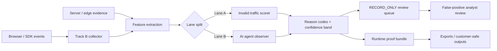

# BuyerRecon Sprint 2 公开研究报告

## 执行摘要

你现有的 Sprint 1 文档已经把 BuyerRecon 的 Track B 证据底座建成了清晰的方向：`ingest_requests`、`accepted_events`、`rejected_events`、`validator_version`、`request_id`、`event_origin`、`traffic_class` placeholder、去重索引、路由级 `/v1/event` 与 `/v1/batch`、以及真实 DB reconciliation/verification suite 都已经被定义为“**先做证据写入，不做 bot/AI/scoring 结论**”的分层架构。这一点非常关键，因为 Sprint 2 最正确的做法不是推倒重来，而是在现有 evidence foundation 上**追加 feature extraction、reason codes、confidence bands、scoring versioning、RECORD_ONLY harness 和 false-positive review**，而不是把 collector 变成一个会瞬时下结论的黑盒。fileciteturn0file1 fileciteturn0file3 fileciteturn0file4 fileciteturn0file5 fileciteturn0file6 fileciteturn0file15 fileciteturn0file16

从公开市场看，成熟工具几乎都遵循同一条链路：**原始行为采集 → 派生特征 → 风险/质量分类 → 人工或规则覆盖 → 运营可见性**。他们很少把“行为”直接包装成“真相”。越成熟的产品，越强调 likelihood、risk score、verified bots、threat reasons、selector-level evidence、custom rules、simulated block 或 fail-soft，而不是“我们 100% 知道这是 bot / AI / buyer intent”。Cloudflare 用 1–99 bot score 与 verified bots，Fingerprint 用 server-side Smart Signals 与 Suspect Score，HUMAN 用 risk score + bot indicators，TrafficGuard 用 threat reasons，DataDome 用 suspicious-context Device Check，这些都说明 BuyerRecon 的 v1 应优先选择**可解释的确定性评分与证据链**，而不是不透明模型。([developers.cloudflare.com](https://developers.cloudflare.com/bots/concepts/bot-score/))

### Top 10 信号教训

1. reload 必须先当作**导航类型**而不是重复 pageview；`PerformanceNavigationTiming.type` 和 browser navigation instrumentation 都能直接给出这层语义。([developer.mozilla.org](https://developer.mozilla.org/en-US/docs/Web/API/PerformanceNavigationTiming/type))  
2. 同 URL 重复访问不能直接判 refresh-loop；它可能是 hard refresh、back/forward、SPA soft nav、手动重复埋点。([developers.google.com](https://developers.google.com/analytics/devguides/collection/ga4/views))  
3. 可见性/焦点状态是“活跃时间”最稳定的底层信号；`beforeunload`/`unload` 不适合作为关键证据。([support.google.com](https://support.google.com/analytics/answer/11109416?hl=en))  
4. rrweb、Clarity、Sentry、PostHog 的最小公共采集面是 DOM 变化、点击/输入、滚动、窗口变化与导航。([github.com](https://github.com/rrweb-io/rrweb/blob/master/docs/observer.md))  
5. rage/dead click 是经验规则，不是自然常量；不同厂商阈值不同，所以 BuyerRecon 应保存原始 cluster 特征，而不是厂商阈值结论。([help.hotjar.com](https://help.hotjar.com/hc/en-us/articles/36820019361041-Use-Cases-for-Filtering-Recordings))  
6. 同文档导航与硬导航必须分开；否则 refresh-loop 与正常 SPA 行为会混淆。([github.com](https://github.com/open-telemetry/opentelemetry-browser/blob/main/packages/instrumentation/README.md))  
7. 分析类 engagement 指标容易被重复 pageview 或多页切换“刷高”，不能当 buyer verification 真值。([support.google.com](https://support.google.com/analytics/answer/12195621?hl=en))  
8. 资源 timing / web vitals 是强上下文，但不是 intent 证明或 fraud 证明。([github.com](https://github.com/open-telemetry/opentelemetry-browser/blob/main/packages/instrumentation/README.md))  
9. session continuity 必须能跨 refresh 追踪，否则无法解释“同 tab 里的重复进入”与“新会话再访问”的差异。([sentry.zendesk.com](https://sentry.zendesk.com/hc/en-us/articles/23699186513947-Session-Replay-FAQ))  
10. 隐私遮罩应是默认策略；Clarity 与 Sentry 都把遮罩放在默认路径，而不是事后补丁。([github.com](https://github.com/microsoft/clarity))  

### Top 10 机器人/欺诈教训

1. client-only 检测不够；成熟系统都在混用 client + server 证据。([docs.fingerprint.com](https://docs.fingerprint.com/docs/smart-signals-introduction))  
2. Verified bots / good bots / signed agents 一定要与 bad bot 逻辑分离。([developers.cloudflare.com](https://developers.cloudflare.com/bots/concepts/bot/verified-bots/))  
3. JS detections 有价值，但通常只是证据，不自动等于封禁。([developers.cloudflare.com](https://developers.cloudflare.com/cloudflare-challenges/challenge-types/javascript-detections/))  
4. 纯 IP/数据中心/代理信誉信号假阳性高，不能单独裁决。([blog.cloudflare.com](https://blog.cloudflare.com/residential-proxy-bot-detection-using-machine-learning/))  
5. 重复点击或高频访问并不必然是 bot；TrafficGuard 公开把一部分这类流量归为 non-incremental 的真人行为。([help.trafficguard.ai](https://help.trafficguard.ai/en/articles/8984177-threat-categories))  
6. GIVT/SIVT 与具体 threat reason 分层，依然是最成熟的公开运营语义。([help.trafficguard.ai](https://help.trafficguard.ai/en/articles/6765041-general-and-sophisticated-invalid-traffic))  
7. 敏感上下文才适合升到 Device Check / Challenge。([docs.datadome.co](https://docs.datadome.co/docs/device-check))  
8. 系统失败时要 fail-soft/fail-open，避免把大量真人流量误伤。([docs.datadome.co](https://docs.datadome.co/docs/akamai-edge-worker))  
9. Score 应该是 risk/likelihood，不该被外宣成 certainty。([developers.cloudflare.com](https://developers.cloudflare.com/bots/concepts/bot-score/))  
10. 学术与开源现实都表明：高级 evasive bots 会绕过前端检测，所以 v1 不要过度宣传“精准识别”。([arxiv.org](https://arxiv.org/abs/2501.10874))  

### Top 10 评分教训

1. 成熟产品给的是 score + category + operator controls，而不是孤立总分。([developers.cloudflare.com](https://developers.cloudflare.com/bots/concepts/bot-score/))  
2. reason codes / indicators 是运营信任的关键。([help.trafficguard.ai](https://help.trafficguard.ai/en/articles/6761177-threats-report))  
3. 服务端验证结果比前端 hints 更适合进入正式评分。([docs.humansecurity.com](https://docs.humansecurity.com/applications/bd-overview))  
4. UX 工具更常给 label 而不是总分；这对 BuyerRecon 是好事，因为说明**解释层先于模型层**。([learn.microsoft.com](https://learn.microsoft.com/en-us/clarity/insights/semantic-metrics))  
5. engagement score/bounce rate 类指标会被刷新或多页切换误导。([support.google.com](https://support.google.com/analytics/answer/12195621?hl=en))  
6. 版本化非常重要；就像 OTel 要对 semconv 做迁移，BuyerRecon scoring 也必须 versioned。([github.com](https://github.com/open-telemetry/opentelemetry-js-contrib/blob/main/packages/instrumentation-document-load/README.md))  
7. 规则覆盖能力（custom rules / sim block / review queue）比“模型多复杂”更接近真实运营价值。([docs.datadome.co](https://docs.datadome.co/docs/configure-custom-rules))  
8. selector/page/session 级证据，比抽象 visitor-level score 更利于复盘。([docs.sentry.io](https://docs.sentry.io/product/explore/session-replay/replay-page-and-filters/))  
9. 最稳妥的 v1 是 deterministic rubric，而不是黑盒模型。([help.trafficguard.ai](https://help.trafficguard.ai/en/articles/6761177-threats-report))  
10. score 必须能被重放、复算、解释，否则不配叫 evidence-grade。fileciteturn0file13 fileciteturn0file16  

### Top 10 AI-agent 教训

1. 公开生态已经分裂为 crawler、user-triggered fetcher、signed agent、browser-style agent 多类。([developers.openai.com](https://developers.openai.com/api/docs/bots))  
2. Google-Extended 是 robots.txt token，不是独立 HTTP UA；这说明“AI 使用控制”与“网络层识别”不是一回事。([developers.google.com](https://developers.google.com/crawling/docs/crawlers-fetchers/google-common-crawlers))  
3. OpenAI 已公开提供 crawler/user-agent 控制面；这说明“声明型 AI 流量”可被单独建模。([developers.openai.com](https://developers.openai.com/api/docs/bots))  
4. Anthropic 公开承认 ClaudeBot 抓取训练数据并遵守 robots.txt，但公开 crawler 细节比 OpenAI 更分散。([www-cdn.anthropic.com](https://www-cdn.anthropic.com/8b8380204f74670be75e81c820ca8dda846ab289.pdf))  
5. Cloudflare 已把 signed agents 做成独立概念，且可用 Web Bot Auth 验签。([developers.cloudflare.com](https://developers.cloudflare.com/bots/concepts/bot/signed-agents/))  
6. HUMAN 已把 AI Agents 作为 IVT taxonomy 里的已知 crawler 子类。([docs.humansecurity.com](https://docs.humansecurity.com/advertising/ivt-taxonomy))  
7. DataDome 已把 trusted AI agents 与 malicious bots 并列区分。([datadome.co](https://datadome.co/products/bot-protection/))  
8. 某些 agent 已运行在真实浏览器/虚拟机环境中，UA/`webdriver` 不再足够。([humansecurity.com](https://www.humansecurity.com/ai-agent/google-mariner/))  
9. Lane A 与 Lane B 必须从数据结构、reason code、报表口径上就拆开。([developers.cloudflare.com](https://developers.cloudflare.com/bots/concepts/bot/verified-bots/))  
10. v1 最安全的 AI-agent 识别策略是“声明优先、验证优先、行为推断降级为 observational”。([developers.google.com](https://developers.google.com/crawling/docs/crawlers-fetchers/google-common-crawlers))  

## 核心模式与分道决策

### 刷新循环与重复 pageview 遥测

**Fact**  
在公开文档里，真正可靠的刷新循环底层信号来自浏览器生命周期与导航 API，而不是分析平台的衍生“参与度”指标：`PerformanceNavigationTiming.type` 给出 `reload` / `navigate` / `back_forward`；OTel browser navigation 区分 `same_document`、`hash_change`、`push/replace/reload/traverse`；GA4 既可能自动 page_view，也可能因 history state change 产生 page_view；Sentry 说明 replay session 可以在同一 tab 中跨 refresh 延续。([developer.mozilla.org](https://developer.mozilla.org/en-US/docs/Web/API/PerformanceNavigationTiming/type))

公开行为产品对“刷新循环”本身几乎都不直接建模，而是公开更底层的挫败与轨迹语义：Clarity 的 rage/dead/quick back，Hotjar 的 rage clicks/U-turns，PostHog 的 pageleave 与 dead clicks，Sentry 的 dead/rage selectors，rrweb 的 DOM mutation/scroll/input/resize 记录。([learn.microsoft.com](https://learn.microsoft.com/en-us/clarity/insights/semantic-metrics))

**Inference**  
BuyerRecon 不该把“连续同 URL page_view”直接当 refresh-loop 结论。更合理的做法是用一组**可复算特征**来表达：这是硬刷新、历史遍历、SPA 软导航、埋点双发，还是低交互高重复浏览。换句话说，`refresh_loop` 应是**feature object**，不是原始 event。  

**Recommendation**  
BuyerRecon v1 至少采集并保存以下字段，然后在 feature extraction 层生成 `refresh_loop` 对象：  

- 原始导航：`nav_type`, `same_document`, `hash_change`, `history_change_kind`  
- 会话连续性：`tab_session_id`, `page_instance_id`, `consecutive_same_url_views`, `consecutive_reload_count`  
- 交互前后文：`click_count`, `input_count`, `scroll_count`, `max_scroll_depth_pct`, `time_since_last_meaningful_input_ms`  
- 页面状态：`visibility_state`, `has_focus`, `foreground_duration_ms`, `hidden_duration_ms`  
- 页面响应：`dom_mutation_after_click_count`, `network_after_click_count`, `js_error_count`  

**测试 / 回放 / 复算步骤**  
1. 用同一浏览器 tab 执行：首次访问 → F5 × 3 → back → forward → SPA pushState → hash change。  
2. 检查原始事件是否能稳定区分：`reload`、`back_forward`、`same_document=true`。  
3. 回放 `page_view + page_state + interaction` 序列，重新计算 `consecutive_same_url_views` 与 `consecutive_reload_count`。  
4. 核对 scorer 在同一 `scoring_version` 下是否始终给相同 `reason_codes`。  
5. 把“重复 pageview 但有高滚动/输入”的真人样本放进回归集，验证不会被误判为 refresh-loop。  

**Open decision for Helen**  
是否在 Sprint 2 就把 `tab_session_id` 作为一等字段强制进合同。如果不做，refresh-loop 与“重新打开同 URL”的区分会持续模糊，而且后续不会轻松补回来。  

### 欺诈 / 机器人信号聚合

**Fact**  
成熟 bot/fraud 产品的公开共同点是：client-side 只负责收集部分观察，server-side 或 edge 负责做真正的 corroboration。Fingerprint Smart Signals 通过 Server API 返回；Cloudflare 给 WAF/Workers 暴露 bot score、verified bot、JA3/JA4、detection IDs；HUMAN 用 Sensor → Detector → Enforcer；DataDome 强调对每次请求持续评估数百个客户端和服务端信号。([docs.fingerprint.com](https://docs.fingerprint.com/docs/smart-signals-introduction))

公开资料也说明，很多关键证据不在浏览器里：reverse DNS、IP validation、签名验证、TLS 指纹、header consistency、challenge outcome、endpoint context 都是 server-side/edge-side 的范畴。([developers.cloudflare.com](https://developers.cloudflare.com/bots/reference/bot-management-variables/))

**Inference**  
BuyerRecon 如果只做前端，就无法做“商业上硬”的 invalid traffic verification；最多能做 observation-heavy 的风险提示。如果你想支撑 Lane A 的商业优先级，就要允许 scorer 吸收至少一部分 server-side evidence，哪怕第一阶段只是可选输入。  

**Recommendation**  
把 `fraud_signal` 明确拆成三层：  

- `client_observations`：JS 是否执行、导航类型、visibility/focus、指针/输入/滚动 cadence、显式 automation hints、dead/rage clusters、console/js errors。  
- `server_observations`：IP/ASN reputation、TLS/header mismatch、request burst、cookie continuity、challenge result、s2s route sensitivity、verified bot/signed agent。  
- `observational_only_v1`：canvas/audio/复杂环境伪装、单点品牌浏览器异常、仅凭行为去猜 AI agent。  

**测试 / 回放 / 复算步骤**  
1. 建立四组回归样本：真人正常、真人高频刷新、headless/stealth 自动化、声明型好 bot。  
2. 对每组样本保存原始 `client_observations` 与 `server_observations`。  
3. scorer 只允许在“至少两类独立证据族命中”时升到 `medium` 以上。  
4. 从 evidence ledger 重放同一样本，检查输出的 `reason_codes` 与 `confidence_band` 是否一致。  
5. 对单条 client-only 信号命中的样本，断言 `action_recommendation` 仍为 `record_only` 或 `review`。  

**Open decision for Helen**  
Sprint 2 是否允许引入最小 server-side evidence。我的建议是允许，并至少为它预留字段；否则 Lane A 会被迫长期停留在“看起来像”而不是“可商业验证”。  

### 评分 worker

**Fact**  
Cloudflare、Fingerprint、HUMAN、TrafficGuard 的公开形态都不是“黑盒模型结果直接输出给用户”，而是“score / category / reasons / custom rules / operator workflow”的组合。TrafficGuard 甚至把每个 invalid click 的 reason 做成可导出的 threat row；HUMAN 公开 bot indicators/capabilities/IP origin；Cloudflare 公开 bot tags、detection IDs；Fingerprint 明说 Suspect Score 不应只在客户端直接决策。([developers.cloudflare.com](https://developers.cloudflare.com/bots/concepts/bot-score/))

你的 Sprint 1 文档也已经把 `validator_version`、`event_origin`、`traffic_class='unknown'`、`canonical_jsonb`、`payload_sha256`、去重与 reconciliation 变成第一类契约。这非常适合继续扩展出 `scoring_version` 与 `evidence_refs`。fileciteturn0file4 fileciteturn0file7 fileciteturn0file12 fileciteturn0file13

**Inference**  
BuyerRecon 的评分 worker 不该把自己定位成“AI 模型判断器”，而应定位成“**证据汇总器 + 决策版本器**”。也就是说，score 是压缩视图，`reason_codes` 与 `evidence_refs` 才是合同核心。  

**Recommendation**  
v1 用 deterministic rubric：  

- 输入：`refresh_loop`、`feature_extraction`、`fraud_signal`、`lane` context  
- 输出：`score`, `confidence_band`, `reason_codes`, `evidence_refs`, `action_recommendation`, `scoring_version`  
- 规则：  
  - `high` 只允许在“强服务端证据 + 独立行为 corroboration”下出现  
  - `medium` 允许多证据族但无显式验证  
  - `low` 或 `review` 处理所有 client-only、AI 推断型、边缘冲突型样本  

**测试 / 回放 / 复算步骤**  
1. 固定一套 scorer weights/thresholds，生成 `scoring_version=s2.v1.0`.  
2. 对同一 evidence bundle 连续复算 10 次，断言输出完全一致。  
3. 修改一条阈值并 bump 到 `s2.v1.1`，断言旧样本复算结果只通过版本变化体现，不静默漂移。  
4. 任取一条 `medium/high` 样本，把 `reason_codes` 逐条映射回原始 evidence，验证每条 code 都可落到原始字段。  
5. 人工随机抽样 20 条结果，用 review queue 验证 score、reason、evidence 是否相符。  

**Open decision for Helen**  
最终外显字段是叫 `verification_score` 还是 `evidence_score`。我建议：内部用 `verification_score` 没问题，对外文案先用 `evidence_score` 或 `verification likelihood`，避免 overclaim。  

### Lane A / Lane B 与 AI-agent taxonomy

**Fact**  
公开生态已经在系统性地区分 bad bots、good bots、signed agents、AI crawlers 与浏览器型 agent。OpenAI crawler docs、Google-Extended、Cloudflare signed agents、HUMAN 的 AI Agents taxonomy、DataDome 的 Agent Trust 都支持这一点。([developers.openai.com](https://developers.openai.com/api/docs/bots))

你现有 Sprint 1 Decision Memo 也已经要求在 schema 里为 `event_origin` 与 `traffic_class` 留钩子，为 Sprint 2 的 bot/agent classification 预留结构，而不是到时候重写 envelope。fileciteturn0file1 fileciteturn0file4

**Inference**  
这意味着 Lane B 不应该被视为“以后再说的附加字段”，而应该是现在就要占坑、但默认 dark-launch 的结构层。否则你会在未来把“已声明 AI crawler”“用户触发 fetch”“疑似浏览器 agent”“坏机器人”混到一个 reason system 里，后面几乎不可收拾。  

**Recommendation**  
Lane B 只做四件事：  
- `declared_agent_family`  
- `verification_method`  
- `agent_confidence`  
- `agent_evidence_refs`  

且明确禁止进入：  
- live URL  
- UTM  
- GA4  
- LinkedIn  
- customer-facing payload labels  
- customer reports  

**测试 / 回放 / 复算步骤**  
1. 造三类样本：声明型 AI crawler、signed agent/partner bot、浏览器自动化 agent。  
2. 断言 Lane B 字段只出现在内部 evidence/scoring 表，不出现在 export/sink。  
3. 对声明型 crawler 做 allowlist/reason test，断言不会流入 Lane A 的 bad-bot codes。  
4. 对浏览器自动化 agent，若无签名/验证，只允许打 observation 型 Lane B code，不能直接给 high confidence。  
5. 抽查 downstream sink（GA4/ads/report export）schema，确认无 Lane B 字段。  

**Open decision for Helen**  
是否在 Sprint 2 就启用 Lane B 的内部存储与 review，但完全不对客户可见。我建议是“**存、测、不开**”。  

## 市场 / 竞品矩阵与开源矩阵

### 市场 / 竞品矩阵

| Product | Behaviour telemetry pattern | Bot/fraud signal pattern | Scoring/quality display | Reason-code transparency | False-positive handling | AI-agent relevance | Source | Confidence |
|---|---|---|---|---|---|---|---|---|
| urlMicrosoft Clarityturn22search11 | DOM/layout/interactions；rage/dead/excessive scroll/quick back | 未指定 | 语义指标，不是统一质量分 | 中 | 未指定 | 低 | [Clarity semantic metrics](https://learn.microsoft.com/en-us/clarity/insights/semantic-metrics) | 高 |
| urlPostHoghttps://posthog.com | autocapture pageview/pageleave/interaction/dead click/session replay | 未指定 | bounce/LCP/path 等分析指标 | 中 | 未指定 | 低 | [PostHog autocapture](https://posthog.com/docs/product-analytics/autocapture) | 高 |
| urlHotjarhttps://www.hotjar.com | recordings + rage clicks + U-turns + errors | 未指定 | 过滤/录屏分析为主 | 中 | 未指定 | 低 | [Hotjar recordings filters](https://help.hotjar.com/hc/en-us/articles/36820019361041-Use-Cases-for-Filtering-Recordings) | 中高 |
| urlGoogle Analytics 4turn2search1 | 自动/手动 page_view；focus/foreground engagement | 非 bot 产品 | engaged session / bounce / engagement rate | 低 | 未指定 | 低 | [GA4 views](https://developers.google.com/analytics/devguides/collection/ga4/views) | 高 |
| urlFingerprintJS BotD / Smart Signalshttps://github.com/fingerprintjs/BotD | client-side automation detection；server-side Smart Signals | good/bad/not detected；server API result | Suspect Score | 中 | 中 | 高 | [BotD repo](https://github.com/fingerprintjs/botd) / [Smart Signals](https://docs.fingerprint.com/docs/smart-signals-introduction) | 高 |
| urlCloudflare Bot Managementturn9search2 | HTML 页 JS detections + every-request edge evaluation | heuristics + ML + fingerprints + behavior + verified bots + signed agents | 1–99 bot score | 高 | 高 | 高 | [Cloudflare bot score](https://developers.cloudflare.com/bots/concepts/bot-score/) | 高 |
| urlCHEQhttps://cheq.ai | 轻 tag + paid interaction 实时评估 | execution environment + behavior + network context | traffic quality / click fraud prevention | 中 | 中 | 中 | [CHEQ click fraud page](https://cheq.ai/solutions/click-fraud-protection/) | 中 |
| urlLuniohttps://www.lunio.ai | deep platform integrations + legitimacy reporting | ML-powered IVT detection；公开细节较少 | legitimacy reporting | 低 | 未指定 | 中 | [Lunio homepage](https://www.lunio.ai/) | 中低 |
| urlTrafficGuardhttps://www.trafficguard.ai | invalid/filtered/success reporting；granular threat report | 200+ signals；GIVT/SIVT；non-incremental/non-genuine/bots-malware | threat report + reason rows | 高 | 中高 | 中 | [Threat categories](https://help.trafficguard.ai/en/articles/8984177-threat-categories) | 高 |
| urlHUMAN Securityturn20search1 | Sensor collects browser/device/behavior；Detector/Enforcer closed loop | hundreds of signals；behavioral analytics；good bot feed | risk score | 高 | 高 | 高 | [Detection overview](https://docs.humansecurity.com/applications/bd-detection-overview) | 高 |
| urlDataDometurn12search0 | edge real-time evaluation；Device Check on suspicious requests | 100s client/server signals；Device Check；Agent Trust | public docs more about policy than raw score | 中 | 高 | 高 | [Device Check](https://docs.datadome.co/docs/device-check) | 高 |
| urlSentry Replayturn27search4 | DOM replay；page visits/mouse/clicks/scrolls；dead/rage widgets | 非 bot 产品 | 无统一质量分 | 中高 | 中 | 低 | [Replay page & filters](https://docs.sentry.io/product/explore/session-replay/replay-page-and-filters/) | 高 |
| urlOpenTelemetry browser instrumentationturn28search0 | browser.navigation/resource timing/user action/web vitals/errors | 非 bot 产品 | 无业务分数；标准化 schema | 高 | 不适用 | 低 | [OTel browser README](https://github.com/open-telemetry/opentelemetry-browser/blob/main/README.md) | 高 |

### 开源矩阵

| Project | Relevant module | Useful technical pattern | Data fields | Testing approach | Risk/complexity | BuyerRecon applicability | Source | Confidence |
|---|---|---|---|---|---|---|---|---|
| urlmicrosoft/clarityhttps://github.com/microsoft/clarity | `clarity-js`, `clarity-decode`, `clarity-visualize` | 采集/解码/可视化分层；默认遮罩；layout + interaction + network inspection | interactions, layout, viewport, network | 公开 repo 可见 `test` 与 Playwright 配置，适合借鉴 replay/integration tests | 中高 | 高：借鉴分层与遮罩，不必自造完整 replay | [Clarity repo](https://github.com/microsoft/clarity) | 高 |
| urlrrwebhttps://github.com/rrweb-io/rrweb | record / replay / incremental snapshots | `MutationObserver`、mousemove 双层节流、setter hook、程序性变更捕获 | DOM add/remove, attrs, text, mouse, scroll, resize, input | 适合 golden replay / ordering / dedupe tests | 中高 | 很高：可直接借鉴 feature extraction 设计 | [rrweb observer doc](https://github.com/rrweb-io/rrweb/blob/master/docs/observer.md) | 高 |
| urlFingerprintJS BotDhttps://github.com/fingerprintjs/BotD | browser automation detector | client-only bot hints 与 server-side Pro 边界非常清晰 | bot boolean / kind / automation families | 用 headless/stealth/framework matrix 做对抗回归 | 中 | 中高：适合 observation slot，不适合单独裁决 | [BotD repo](https://github.com/fingerprintjs/botd) | 高 |
| urlOpenTelemetry Browser Instrumentationhttps://github.com/open-telemetry/opentelemetry-browser | navigation / resource-timing / user-action / web-vitals / errors | 统一事件 schema；same-document/reload 区分；visibility flush；扩展属性 | `browser.navigation.*`, resource timing, user actions, vitals | schema/compatibility/contract tests | 中 | 很高：合同命名与事件层建议直接借鉴 | [OTel browser instrumentation README](https://github.com/open-telemetry/opentelemetry-browser/blob/main/packages/instrumentation/README.md) | 高 |
| urlOpenTelemetry document-load instrumentationhttps://github.com/open-telemetry/opentelemetry-js-contrib/tree/main/packages/instrumentation-document-load | `documentLoad`, `documentFetch`, `resourceFetch` | 首次 HTML load 与 traceparent 关联；自定义 span attributes | URL, UA, fetch/resource spans | first-load tracing / refresh-loop root cause tests | 中 | 高：runtime proof 很有用 | [document-load README](https://github.com/open-telemetry/opentelemetry-js-contrib/blob/main/packages/instrumentation-document-load/README.md) | 高 |
| urlSentry Session Replay docshttps://docs.sentry.io/guides/session-replay/ | replay lifecycle / dead-rage surfacing | sessionStorage continuity；inactivity timeout；selector-level surfacing | page visits, clicks, scrolls, navigations, selectors | selector aggregation 与 inactivity 边界回归 | 中 | 高：false-positive review 与 runtime proof 可直接借鉴 | [Sentry Replay FAQ](https://sentry.zendesk.com/hc/en-us/articles/23699186513947-Session-Replay-FAQ) | 高 |

## BuyerRecon Sprint 2 推荐合同与验证路径

### Sprint 2 的最重要工程原则

**Fact**  
Sprint 1 现有材料清楚表明：Track B 负责 evidence foundation，明确“不实现 bot detection / AI-agent detection / scoring / live RECORD_ONLY”，并已把 event contract、accepted/rejected/ingest_requests、路由、去重、auth boundary、canonical JSONB、DB verification 定义为底座。Sprint 2 应该是**在 Track B 之上增量扩展**，而不是重写 collector。fileciteturn0file3 fileciteturn0file4 fileciteturn0file5 fileciteturn0file6 fileciteturn0file13 fileciteturn0file15

**Inference**  
因此，最合理的 Sprint 2 架构是：Collector 继续只负责证据写入；Feature Extraction、Lane Split、Scoring Worker、Review Queue 与 RECORD_ONLY Harness 作为**下游新增层**。  

**Recommendation**  
Sprint 2 不动以下 Sprint 1 合同语义：  
- `ingest_requests` 是 per-request truth ledger  
- `accepted_events` / `rejected_events` 是 per-event truth ledger  
- `validator_version` / `request_id` / `payload_sha256` 保持第一类字段  
- `event_origin` / `traffic_class` 继续保留并开始被真正使用  
- 所有 scoring 输出进入**新表/新对象**，不污染原始采集表  

### 推荐流程图

下图是建议的 Sprint 2 数据路径。其核心是：**证据先落表，评分后处理，RECORD_ONLY 默认开启，Lane A 与 Lane B 在 scoring 前拆开。**



### 推荐 build contract

下列合同是对你现有 Sprint 1 canonical event/evidence foundation 的**增量扩展**，不替代 Sprint 1，只增加 Sprint 2 所需对象。Sprint 1 已经有 `event_origin`、`traffic_class` placeholder、canonical JSONB 与 validation/reconciliation 方向，这里建议把它们真正落成可用的 Sprint 2 对象。fileciteturn0file1 fileciteturn0file2 fileciteturn0file12

```yaml
signal_truth_contract_version: "signal-truth-v0.1"

page_view:
  required:
    - client_event_id
    - session_id
    - site_id
    - page_view_id
    - event_type
    - occurred_at
    - page_url
    - page_path
    - tab_session_id
  nav:
    type: [navigate, reload, back_forward, prerender, unknown]
    same_document: boolean
    hash_change: boolean
    history_change_kind: [push, replace, traverse, none]
  continuity:
    page_instance_id: string
    previous_page_view_id: string|null
    consecutive_same_url_views: integer
    consecutive_reload_count: integer

page_state:
  required:
    - session_id
    - site_id
    - event_type
    - occurred_at
  state:
    visibility_state: [visible, hidden, prerender, unknown]
    has_focus: boolean
    foreground_duration_ms: integer
    hidden_duration_ms: integer
    idle_ms: integer

feature_extraction:
  interaction:
    click_count: integer
    input_count: integer
    scroll_count: integer
    max_scroll_depth_pct: integer
    rage_cluster_count: integer
    dead_click_candidate_count: integer
  response:
    dom_mutation_after_click_count: integer
    network_after_click_count: integer
    js_error_count: integer
    resource_error_count: integer
  timing:
    time_to_first_interaction_ms: integer|null
    time_to_last_interaction_ms: integer|null
    time_since_last_meaningful_input_ms: integer|null
  environment:
    js_executed: boolean
    webdriver_hint: boolean
    headless_hint: boolean
    user_agent_declared_bot_hint: boolean

fraud_signal:
  client_observations:
    - code: string
      present: boolean
      evidence_refs: [string]
  server_observations:
    - code: string
      present: boolean
      evidence_refs: [string]
  verified_agent:
    is_verified_good_bot: boolean
    is_signed_agent: boolean
    verification_method: [none, reverse_dns, ip_validation, web_bot_auth, partner_allowlist]

refresh_loop:
  consecutive_same_url_views: integer
  consecutive_reload_count: integer
  same_url_window_ms: integer
  reload_streak_window_ms: integer
  has_meaningful_interaction_before_reload: boolean
  back_forward_count: integer
  spa_route_change_count: integer

scoring_input:
  lane_a_invalid_traffic_features: object
  lane_b_agent_features: object
  scoring_version: string

scoring_output:
  lane: [A_INVALID_TRAFFIC, B_DECLARED_AGENT, HUMAN_UNKNOWN, REVIEW]
  score: integer
  confidence_band: [low, medium, high]
  reason_codes: [string]
  evidence_refs: [string]
  action_recommendation: [record_only, review, exclude, allow]
  scoring_version: string

false_positive_review:
  review_id: string
  status: [open, confirmed_fp, confirmed_tp, needs_more_server_data, closed]
  owner: string|null
  notes: string|null
```

### reason-code dictionary 草案

| Code | Lane | Meaning | Minimum evidence rule |
|---|---|---|---|
| `A_REFRESH_BURST` | A | 短窗口同 URL reload burst | `nav.type=reload` + streak/window |
| `A_NO_MEANINGFUL_INTERACTION` | A | 重复进入前缺少有效交互 | low interaction + same-url/reload continuity |
| `A_DEAD_CLICK_CLUSTER` | A | 多次点击后页面无响应 | click + no DOM/network response |
| `A_AUTOMATION_HINT` | A | 自动化环境 hint | client-only，最高 `low` |
| `A_BAD_NETWORK_REPUTATION` | A | 网络来源高风险 | 仅与其他证据组合 |
| `A_TLS_HEADER_MISMATCH` | A | 请求层与浏览器语义不一致 | server evidence |
| `A_CHALLENGE_FAILED` | A | challenge/device check 明确失败 | server/edge outcome |
| `A_BEHAVIORAL_CADENCE_ANOMALY` | A | 节奏显著异常 | 需与别的 family 共现 |
| `B_DECLARED_AI_CRAWLER` | B | 已声明 AI crawler | declared identity |
| `B_SIGNED_AGENT` | B | 已验签 user-controlled agent | signed/Web Bot Auth |
| `B_USER_TRIGGERED_FETCH` | B | 用户触发 fetch / agent request | 只在明确信号下使用 |
| `REVIEW_POSSIBLE_FALSE_POSITIVE` | REVIEW | 证据冲突或敏感场景 | score 不高于 `medium` |

### confidence bands 规则

**Recommendation**  
- `high`：至少 1 个强服务端/验证型信号 + 1 个独立行为类 corroboration  
- `medium`：至少 2 个独立信号族命中，但无显式验证  
- `low`：仅 client-side、仅单家族信号、仅 AI/browser 推断  
- Lane B 默认不输出高置信负面结论；即不能“高置信 AI = 坏流量”  

**测试 / 回放 / 复算步骤**  
1. 为每种 confidence band 准备金标样本各 10 条。  
2. 运行 scorer，检查 `reason_codes` 是否满足最小证据规则。  
3. 抽掉一条关键 server evidence，再复算，断言 `high -> medium/low`。  
4. 把 Lane B 样本混入，断言永远不会在客户输出里触发 Lane A labels。  
5. 留存 evidence bundle，支持复算与人工 review。  

### adversarial RECORD_ONLY 测试矩阵

| Bucket | Scenario | Goal | Expected output |
|---|---|---|---|
| Human noisy | 真人连续 F5、来回 back/forward、频繁切 tab | 防止把 noisy human 误判成 bad bot | `low` 或 `review`，不 `exclude` |
| Human high-friction | 页面慢、按钮假死、出现 dead/rage click | 验证 UX 挫败不应自动变成 fraud | Lane A 不升高，保留 UX reason |
| Browser automation | Playwright / Selenium / Puppeteer / headless / stealth | 测 automation hints 与多证据聚合 | 至多 `medium`，除非有 server corroboration |
| Declared good bot | verified bot / allowlisted monitor / signed agent | 防止错杀 | `allow` 或 Lane B only |
| AI crawler | OpenAI / Google-Extended related declared traffic | 验证 Lane B 分道 | 不进客户报表 |
| Server anomaly only | bad reputation / TLS mismatch，但前端行为正常 | 验证“单类 server evidence 不直接定罪” | `review` 或 `medium` |
| Replay / resend | 同一 `client_event_id` 跨请求重试 50 次 | 验证 dedupe 与 RECORD_ONLY 稳定性 | 1 accepted + N−1 duplicate/review |
| Null/edge data | 无 JS、adblock、privacy browser、企业代理 | 假阳性边界 | `low` 或 `review` |

### runtime proof

**Recommendation**  
每个进入 scoring 的对象都必须能导出一份 proof bundle，至少包括：  
- 原始事件 ID 列表  
- 所属 `request_id` / `validator_version` / `scoring_version`  
- feature extraction 快照  
- `reason_codes`  
- `confidence_band`  
- `evidence_refs`  
- 复算所需阈值/权重摘要  

**测试 / 回放 / 复算步骤**  
1. 任取一条 `medium/high` 记录。  
2. 导出 proof bundle。  
3. 在隔离环境按 `scoring_version` 复算。  
4. 断言 score/confidence/reasons 完全一致。  
5. 让审阅人不看原始页面，只看 bundle，验证是否能理解结论。  

### Codex review checklist

**Recommendation**  
- 不允许单独使用 `navigator.webdriver`、UA、IP reputation、无交互下结论  
- 不允许 Lane B 字段出现在任何 customer-facing 输出  
- 不允许 `score` 无 `reason_codes`  
- 不允许 `reason_codes` 无 `evidence_refs`  
- 不允许 silent 修改 scorer；必须 bump `scoring_version`  
- 不允许 collector/scorer 故障影响正常页面功能  
- 不允许将高敏原始表单值引入 Sprint 2 signal contract  
- 必须保留 RECORD_ONLY 开关  
- 必须保留 replay/recompute 通道  
- 必须有 false-positive review queue 与 rollback 演练  

### rollback path

**Recommendation**  
实现分层 kill switch：  
- `disable_feature.refresh_loop=true`  
- `disable_feature.dead_click_rules=true`  
- `disable_feature.client_automation_hints=true`  
- `force_action.record_only=true`  
- `disable_lane_b_exports=true`  
- `scoring_version=previous`  
- `skip_scoring_worker=true`（只保留证据采集）  
- `collector_minimal_mode=true`（仅 page_view/page_state）  

**测试 / 回放 / 复算步骤**  
1. 在线上影子环境打开 scoring。  
2. 模拟高误判告警。  
3. 依次触发：`force_action.record_only`、`scoring_version rollback`、`skip_scoring_worker`。  
4. 验证原始 evidence 仍持续写入。  
5. 验证对客户的所有输出消失或退回最小模式，而不是写出坏数据。  

## 学习路径与最终基准

### 学习路径

团队建议系统补课的技能栈：

- 浏览器生命周期与导航 API  
- DOM mutation 与事件采集  
- Resource Timing / Navigation Timing / Web Vitals  
- 行为特征工程  
- fraud/bot signal family 设计  
- client/server corroboration 设计  
- deterministic scoring 设计  
- reason-code dictionary 设计  
- confidence band 设计  
- false-positive review 实务  
- AI-agent taxonomy 与验证方法  
- adversarial RECORD_ONLY 测试  
- runtime proof / replay / recomputation  
- rollback 与 operator runbook 设计  

### 最终基准表

| Module | Market benchmark | BuyerRecon v1 最低 | Evidence-grade improvement | Not-now / defer |
|---|---|---|---|---|
| Refresh telemetry | GA4/OTel/Sentry 都区分不同导航与会话边界。([developers.google.com](https://developers.google.com/analytics/devguides/collection/ga4/views)) | `nav_type`、same-url streak、tab continuity、page state | 把 refresh-loop 做成可复算 feature object | 完整录屏 UI |
| Fraud aggregation | Cloudflare/HUMAN/DataDome 都做 client+server 聚合。([developers.cloudflare.com](https://developers.cloudflare.com/bots/reference/bot-management-variables/)) | client observations + server observation slots | observation / verified / inferred 三层分离 | 复杂指纹引擎 |
| Scoring worker | Cloudflare/Fingerprint/TrafficGuard 都有 risk-like 输出。([developers.cloudflare.com](https://developers.cloudflare.com/bots/concepts/bot-score/)) | deterministic rubric + versioning | proof bundle + reproducible score | 黑盒 ML ensemble |
| Reason codes | TrafficGuard/HUMAN/Cloudflare 都有公开运营语义。([help.trafficguard.ai](https://help.trafficguard.ai/en/articles/6761177-threats-report)) | 12–20 个稳定 code | 每个 code 强绑定最小证据规则 | 动态自动生成文案 |
| Confidence bands | 市场普遍做 score/likelihood，不做绝对真值。([developers.cloudflare.com](https://developers.cloudflare.com/bots/concepts/bot-score/)) | `low/medium/high` 三档 | 用证据结构定义带宽 | 概率校准外宣 |
| False-positive review | verified bots / custom rules / sim block / fail-soft 是成熟模式。([developers.cloudflare.com](https://developers.cloudflare.com/bots/concepts/bot/verified-bots/)) | review queue + RECORD_ONLY | 把误判治理前置到研发流程 | 全自动在线调权 |
| Lane B AI-agent | Cloudflare signed agents / HUMAN AI Agents / DataDome Agent Trust。([developers.cloudflare.com](https://developers.cloudflare.com/bots/concepts/bot/signed-agents/)) | dark-launch schema + internal review | 坚决不进客户报表/URL/UTM | 对外售卖 AI-agent 产品 |
| Runtime proof | 你现有 Sprint 1 已经有 canonical JSONB、hash、reconciliation 思路。fileciteturn0file12 fileciteturn0file16 | score/evidence bundle | 同版复算、审计、抽检 | 图形化 console |
| RECORD_ONLY harness | Sprint 1 已有 live-hook runbook、stress proof 与 DB verification mindset。fileciteturn0file9 fileciteturn0file10 fileciteturn0file16 | adversarial bucket suite | 对抗场景成为 release gate | 线上自动阻断 |

## 研究限制与 Helen 待决项

### Fact

本报告优先使用官方公开产品页、帮助中心、公开 GitHub、MDN/W3C 类标准文档与已上传的 Sprint 1 文档摘要。部分商业产品，尤其是 urlCHEQhttps://cheq.ai、urlLuniohttps://www.lunio.ai、部分 urlDataDometurn12search0 与 urlHUMAN Securityturn20search1 的实现级细节没有对外公开，所以矩阵中已用“未指定”或较低置信度标注，避免以营销叙事替代实现事实。([cheq.ai](https://cheq.ai/solutions/click-fraud-protection/))

### Inference

对 BuyerRecon 来说，这种资料缺口反而说明：最值得复制的不是“对方的内部模型怎么做”，而是**他们公开暴露给运营、法务、客户成功与工程调试的那层结构**。那一层，才是可执行、可审计、可销售、可回滚的真正产品模式。  

### Recommendation

Helen 现在最值得拍板的五件事：  
1. Sprint 2 是否允许引入最小 server-side evidence。  
2. `tab_session_id` 是否强制进入合同。  
3. 外显术语是 `evidence_score` 还是 `verification_score`。  
4. Lane B 是否“存、测、不开”。  
5. RECORD_ONLY 至少持续多久才允许任何自动动作上线。  

### Open decision for Helen

如果只能选一个最高优先级决策，我建议先拍板：**Sprint 2 scorers 是否只做下游新增表与 proof bundle，不回写污染原始 evidence ledger。**  
我的结论是：**必须如此。**  
这是 BuyerRecon 保持 evidence-first 的总闸门。